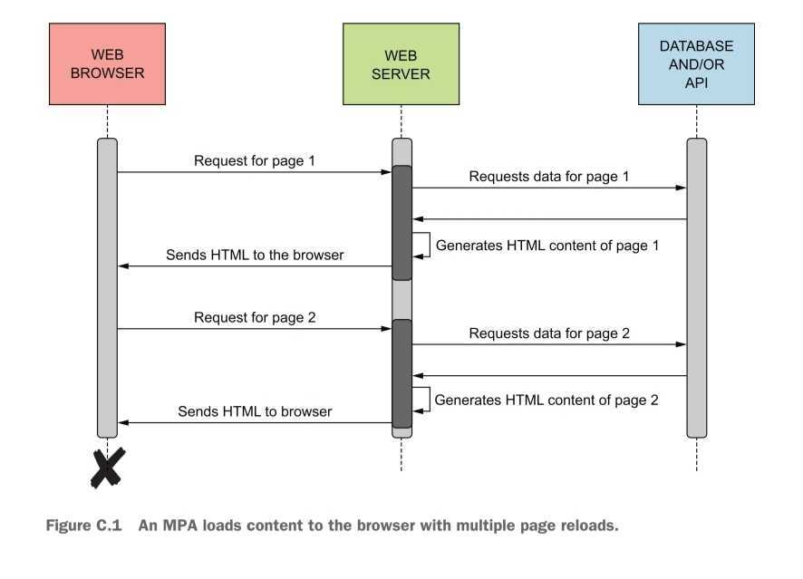
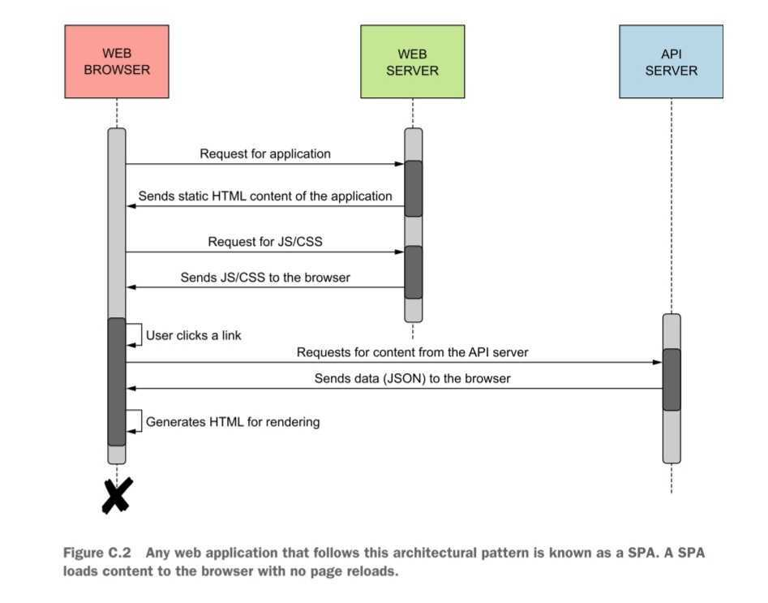

# Single Page Application
- architectural pattern used to develop frontend, user-facing web application
- SPA vs MPA
	- MPA: multipage application
		- traditionally used
		- the web server renders html every time web browser makes a request
		
	- SPA
		- When application first loads, initial html, css, and javascript are loaded to the browser.
		- html is dynamically generated in the browser thorugh javascript that is already loaded
		- data is downloaded directly from the webserver in the browser.
		
- benefits
	- beyond initial loading of the appliation, page rendering is faster. \
	since html is generated in client side, and the amount of data downlaoded is less.
	- load of the webserver is reduced
	- application deisgn is simple, thus can be hosted in any environment with http
	- application becomes more flexible since it can talk to any number of microservices
	- With good http-based rest api, it can use caching effectively.

- drawbacks
	- with heavy or unresponsive javascript, it can give bad user experience
	- prone to XSS(cross-site scripting) since it depends on js
	- does not work in javascript disabled browser.
	- initial loading may be slow
	- hard to handle sensitive information like user credentials or token.
