# Streaming 101

## Batch vs Streaming

- Batch

  - batch: 집단, 무리
  - 일괄 처리. 쌓여있는 데이터를 한 번에 처리
  - 일정 시간 동안 데이터 적재 -> 모은 데이터를 분석 시스템에 주입하여 분석
  - bounded data
  - streaming보다 먼저 생김

  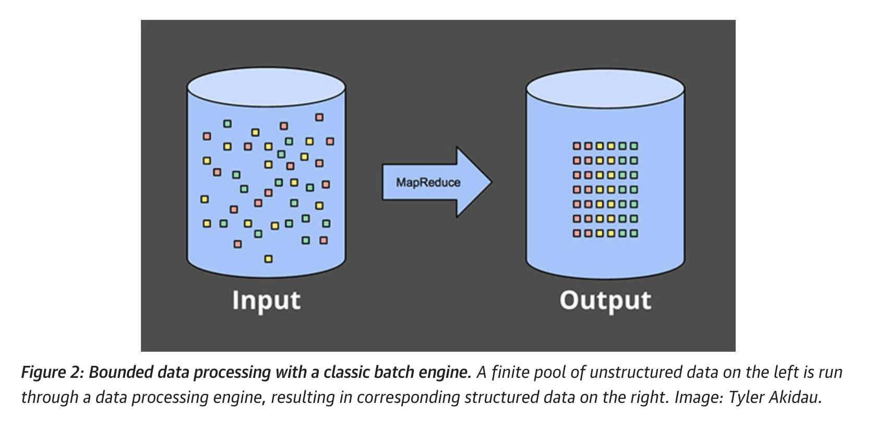

- Streaming
  - stream: 강, 흐름
  - 지속적으로 흘러들어오는 데이터를 그때그때 처리
  - 데이터가 들어올 때마다 분석 시스템에 주입하여 분석
  - unbounded data

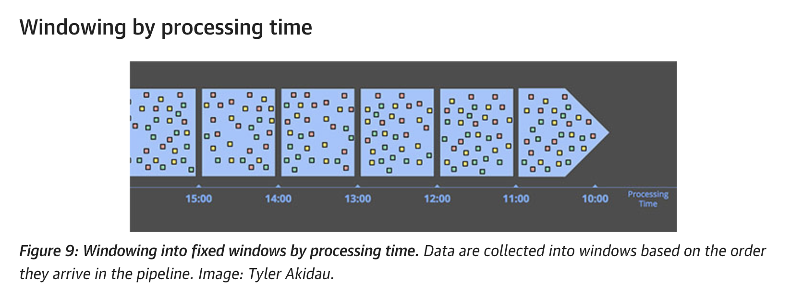

## time concepts of data

- event time
  - the time at which events actually occurred
- processing time
  - the time at which events are observed in the system
- problem
  - `event time != processing time`
    - event가 늦게 도착할 수 있다
    - 언제 event가 도착할지 모른다.
    - event time 순서대로 데이터가 쌓이지 않는다.
    - (processing time - event time)가 어떤 숫자보다 작다고 보장할 수 없다. \
      (processing time - event time)는 일정하지 않고 다르다
  - why?
    - Shared resource limitations(network congestion, network partitions,shared CPU)
    - Software causes(distributed system logic, contention, ...)
    - environment: mobile, airplane mode, ....
  - ex)
    - mobile tetris game
    - game score sent to server every time people play the game
    - event time: 게임이 끝나서 점수가 결정되는 시점
    - processing time: 게임 점수가 서버에 도착한 시점

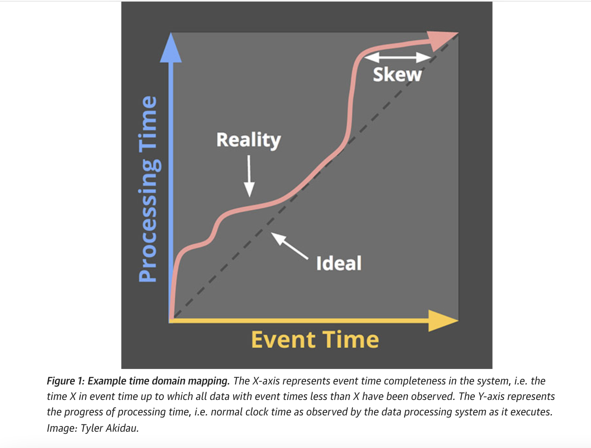

## Data processing patterns

### Batch

- Fixed Size Window
  - how
    - slice by fixed size window => set of small bounded data
    - repeated runs of batch engine on each of small bounded data
      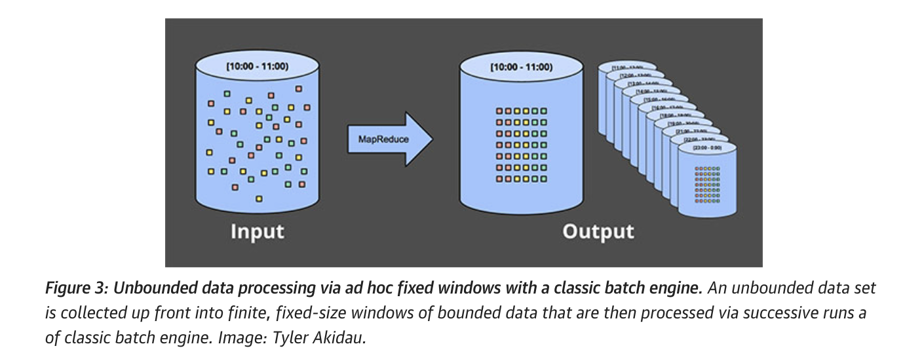
  - problem
    - what about late data?
    - need further mitigation \
      (delay the run until all events arrive, \
      re-run the entire batch)
- Session
  - session: period of activity(ex. 30 min of activity of a user)
    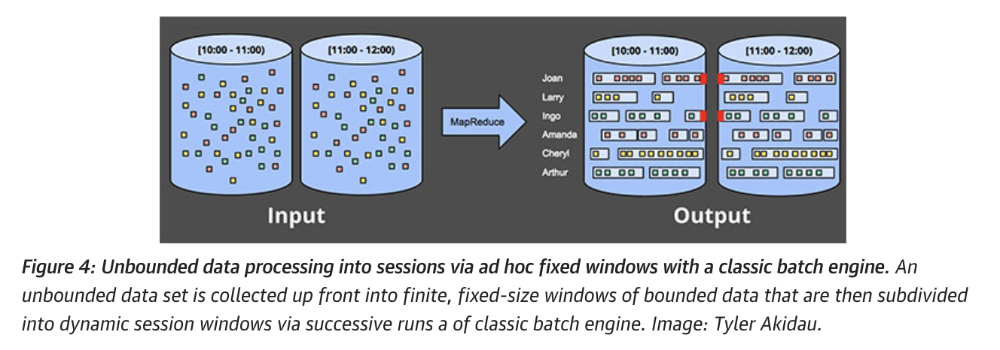
  - problem
    - sessions are split across batches
    - need to increase batch size -> increased latency
    - additional logic to glue up sessions in previous runs -> increased complexity

### Streaming

- time agnostic(시간과 상관 없는)
  - ex) filtering
    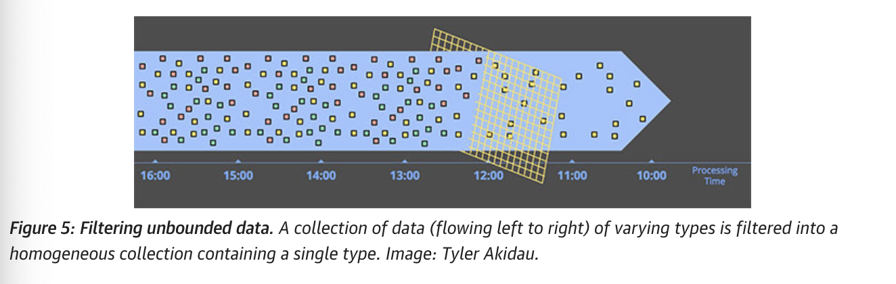
- [approximation algorithm](#streaming-algorithm)
  - approximate Top-N, streaming K-means
  - low overhead, but complicated
  - usually processing-time based
  - if provable error bounds are dependent on data order, no use
    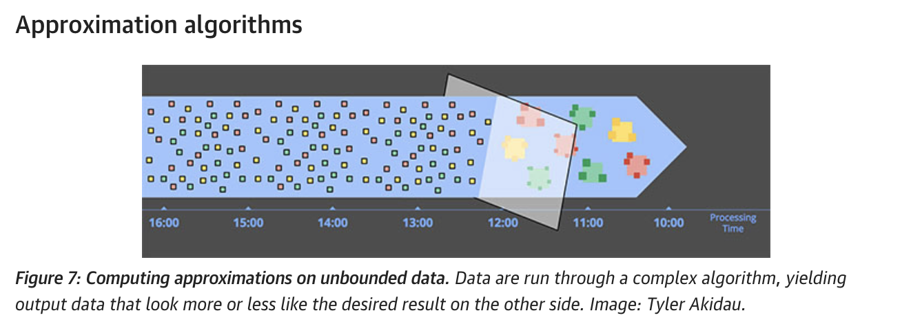
- windowing
  - 전체 범위를 일정 단위로 조각낸 것
    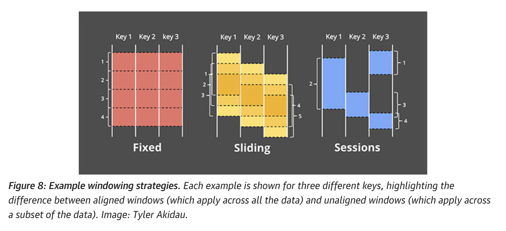
    - fixed window(tumbling window)
    - sliding window
      - fixed window의 일반화 버전
      - defined by fixed length, and a fixed period
      - if period < length, window overlap
      - if period == length, it is fixed window
    - session
      - dynamic window
      - sequence of events terminated by a gap of inactivty greater than som etimeout
      - analyzing user behavior over time, by grouping related events
      - lengths are not predefined a prior
  - by processing time
    - buffer up incoming data into windows until some amount of processing time has passed
      
    - simple
    - window completeness is clear
    - when analyzing by the source as it is observed
    - problem
      - ex)
        mobile app
        distributed input source, when unhealthy
  - by event time
    - 이벤트 발생 시간 기준
      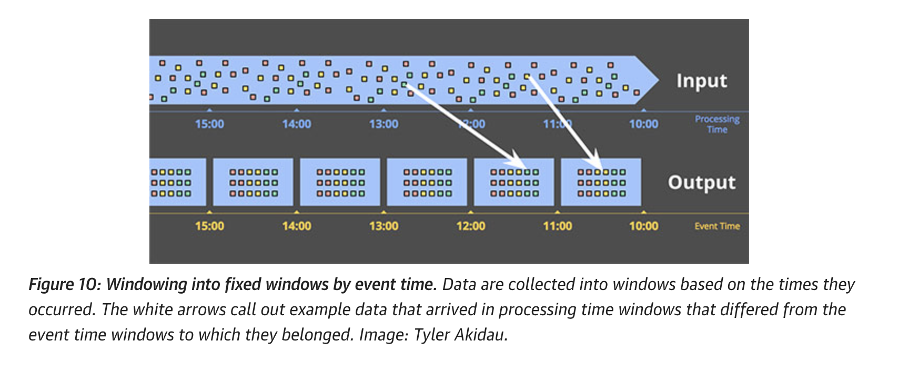
      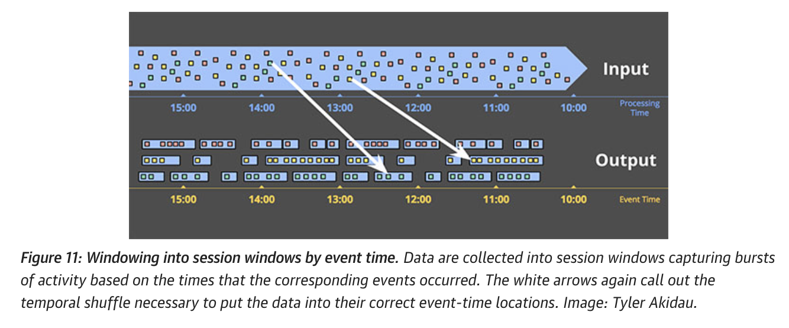
    - buffering
    - extended window lifetime
    - solved with consistent persistent storage & decent in-memory caching
    - completeness
      - hard to know the end of the window
      - watermark
      - trigger

## Streaming concepts

> - X-axis: event time
> - Y-axis: processing time (on the Y axis).
> - -> real time: bottom to top
> - circle: inputs. \
>   the number inside the circle: the value of the record.
> - when the number changes to yellow, it means calculated
>
> ex) summation of numbers
>
> - Classic batch processing
> - Windowed summation on a batch engine
> - Windowed summation on a streaming engine

What / Where / When / How

### What: transformation

- "What results are calculated?"
- ex) integer sum, filter, building histograms, training machine learning models
  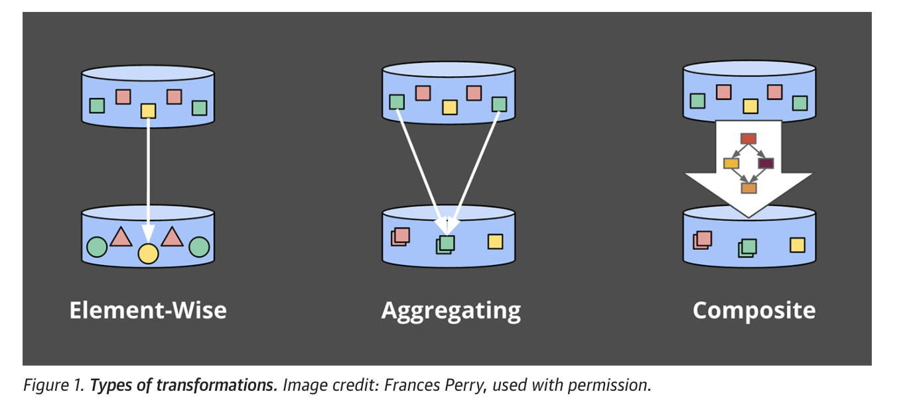
  > composite: combination of transformations

### Where: window

- "Where in event time are results calculated?" \
  event time을 어떻게 나누어서 결과를 계산할까? \
  (windowing 방법)
- with windowing: fixed, sliding, and sessions
- without windowing: time-agnostic

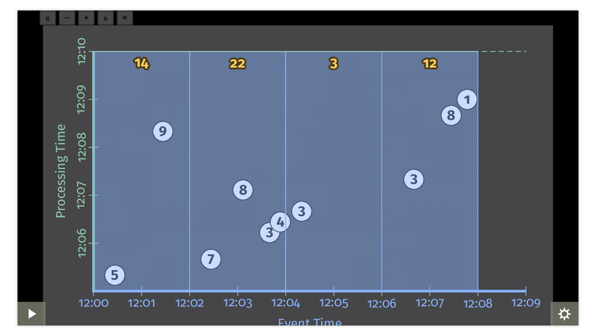

### When: Watermark, Trigger

- “When in processing time are results materialized?” \
  processing time을 기준으로 언제 집계/연산을 실행할까?
- when the input for the given window is complete?
- when to calculate?

#### watermark

- temporal notions of input completeness in the event-time domain. \
  input completeness에 대한 보장
- input with event times less than E have been observed. \
  watermark 이전에 발생한 데이터는 모두 도착했다 \
   watermark보다 작은 event time을 갖는 데이터는 모두 도착했다
- it’s an assertion that no more data with event times less than E will ever be seen again.
- lower bound of the event times of all unreceived events.
- the lowest timestamp that may yet appear in a stream.
- peferct watermark(conformant watermark), heuristic watermark(nonconformant watermark)

  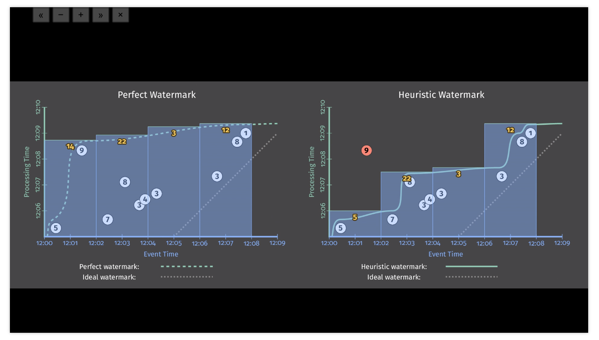

- drawbacks
  - too slow
    - takes longer time to get output
  - too fast
    - missing data
  - ex)
    - perfect : [12:02, 12:04)'s output comes around 12:09,
      while first input was around 12:04
    - heuristic : [12:02, 12:04)'s output comes around 12:07,
      but, missing data in [12:00, 12:02)
- how to generate watermark?
  - making confront watermark is impractical
  - we need to estimate the lag and generate heuristic watermark
  - bounded lag
    - assume that the event will arrive no later than certain bounded constant
    - max event time ever seen + timeout delay
    - Apache Kafka streams, [Spark Structured Streaming](https://spark.apache.org/docs/latest/structured-streaming-programming-guide.html#handling-late-data-and-watermarking)
  - timeout
    - when we first see the element with event time t, we wait for some constant duration and change the watermark to time t.
  - stastical model
    - model the behavior of the event source, and adapt the watermark delay accordingly
    - ex)
      1. calculate a rolling histogram of the element lag
      2. fit it to a statisical moel(ex. gamma distribution)
      3. approximates the delay with the certain quantile
      4. re-evaluate the fit periodcially
    - Google Cloud Dataflow: histogram
    - https://vldb.org/pvldb/vol14/p3135-begoli.pdf, page 5. Figure 1, 2
  - custom logic
    - utilize input source’s unique characteristics
    - a conformant watermark generator for a Kafka topic whose static set of partitions are known to contain monotonically increasing timestamps,
    - Google Cloud Dataflow’s bespoke watermark generator for Google Pub/Sub

#### trigger

- 언제 output을 계산할지
- when output for a window should happen in processing time
- type
  - Watermark progress
    - when watermark reaches the end of the window
  - Processing time progress
  - Element counts
  - Punctuations(other data-dependent triggers): specific record like EOF element, flush event, etc.
  - compoiste signals:
    - Repetitions: regular periodic updates
    - Conjunctions (logical AND)
    - Disjunctions (logical OR),
    - Sequences, which fire a progression of child triggers in a predefined order.

#### allowed lateness

- 언제 window를 종료할지
  > place a bound on how late any given record may be (relative to the watermark)
- inefficient/impossible to hold the intermediate state until the end of the window(no end, memory limit)
- event time 기준의 late data
- watermark는 A시점 이전 데이터는 다 도착했다. \
  allowed lateness는 watermark보다 X만큼 늦게 들어온 데이터까지만 취급한다.
- processing time이 watermark + allowed lateness를 지나면 close the window
- watermark + allowed lateness보다 늦게 도착한 data는 ignore / recompute

### How: accumulation

- “How do refinements of results relate?”
- output을 계산하는 방식

  - discard
    - Every time results are computed, any stored state is discarded.
    - when the downstream consumer is aggregating by itself
    - ex) passing integer to the downstream, downstream is calculating sum of int.
  - accumulating
    - overwrite
    - ex) storing output in a key/value store like BigTable or HBase.
  - accumulate & retract
    - distract the old value, and ovewrite new value
    - when consumer regroups with dynamic dimension
    - when dynamic windowing(sessions)

  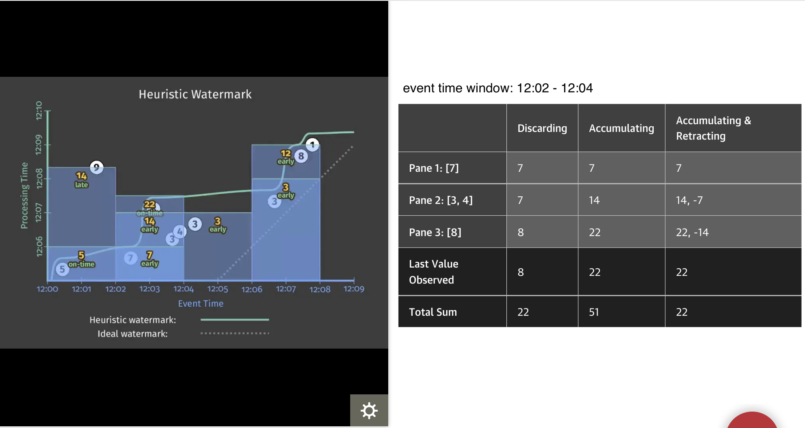

## Different type of windowing

- processing time based
  - put ingress time as event time
- session

  - 일정 시간의 inactivity로 구분되는 small window의 모음
    > definition: a composition of a set of smaller, overlapping windows, \
    >  each containing a single record, \
    >  with each record in the sequence separated from the next \
    >  by a gap of inactivity no larger than a predefined timeout.

  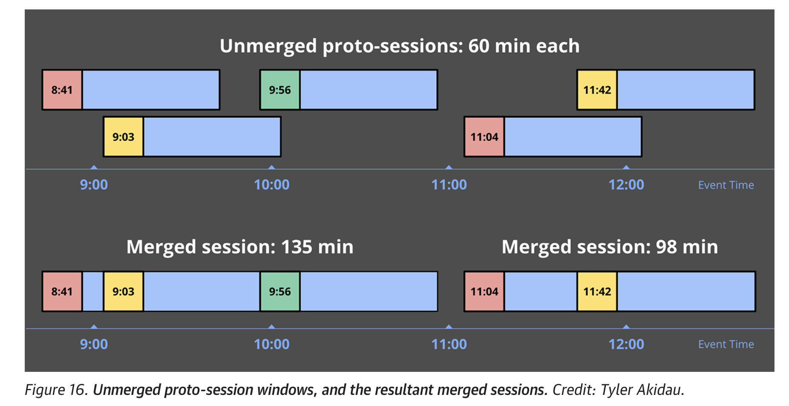

---

# reference

- oreilly's post streaming 101, 102: \
  https://www.oreilly.com/radar/the-world-beyond-batch-streaming-101/ \
  https://www.oreilly.com/radar/the-world-beyond-batch-streaming-102/
- Tyler Akidau, Edmon Begoli, Slava Chernyak, Fabian Hueske, Kathryn Knight, Kenneth Knowles, Daniel Mills, and Dan Sotolongo. 2021. Watermarks in stream processing systems: semantics and comparative analysis of Apache Flink and Google cloud dataflow. Proc. VLDB Endow. 14, 12 (July 2021), 3135–3147. DOI:https://doi.org/10.14778/3476311.3476389

## todo

- lambda, kappa architecture

---

## Add on

### streaming algorithm(approximation) 

- constraint
  - memory constraint
  - (limited processing time per item)
  - small number of passes.
- similar with online learning. \
  streaming algorithm can defer action until a group of points arrive, whereas online learning make decision as each point arrives
- ex)
  - streaming linear regression
    - update the regression on each data input
  - streaming k-means
    - diverse implementation
    - ex) [pyspark implementation](https://databricks.com/blog/2015/01/28/introducing-streaming-k-means-in-spark-1-2.html)
      - mini-batch k-meanns with half-life & dying cluster
      - half-life: the time it takes before past data contributes to only one half of the current model. \
        ex) 0.5 batch half life -> 2 batches, 5 batch half life -> 10 batches to finish the change
      - dying cluster: invalid cluster
  - Frequency moments
    - The kth frequency moment of a set of frequencies $\mathbf {a}$ is defined as \
      ${\displaystyle F_{k}(\mathbf {a} )=\sum_{i=1}^{n}a_{i}^{k}}$
    - $F_0$: distinct count
    - $F_1$: sum
    - $F_k$: statistical properties
  - https://en.wikipedia.org/wiki/Streaming_algorithm

---

## Review

- Batch
  - 일괄 처리. 데이터를 모았다가 한 번에 집계/연산.
  - ex) 일자별로 로그를 저장하고 자정마다 error log의 개수를 세는 작업. \
    2022-01-01.log, 2022-01-02.log의 형태로 저장하고, \
    2022-01-02 0시에 2022-01-01.log에 들어있는 count(error log)를 계산
- Streaming: 실시간 처리. 데이터가 들어오는 대로 집계/연산
  - ex) 실시간으로 error log의 개수를 수집. \
     로그를 elatic search에 수집. \
     dashboard에 1분마다 error log 수를 업데이트.
- time concepts
  - event time: 이벤트가 발생한 시점. ex) 스마트폰에서 버튼을 클릭한 시점
  - processing time: 이벤트가 시스템에서 관찰되는 시점 ex) 클릭 로그가 로그 서버에 도착한 시점
  - problem
    - `event time != processing time`
      - event가 늦게 도착할 수 있다
      - 언제 event가 도착할지 모른다.
      - event time 순서대로 데이터가 쌓이지 않는다.
      - (processing time - event time)가 어떤 숫자보다 작다고 보장할 수 없다. \
        (processing time - event time)는 일정하지 않고 다르다
- batch의 문제점
  - processing time보다 event time 기준으로 처리하는 경우가 더 많다. \
    (시스템에서 관찰된 시점보다 실제로 이벤트가 발생한 시점)
  - 늦게 도착한 이벤트가 있으면 다시 집계해야 된다.
  - 이벤트를 언제까지 기다려야하지?
  - session처럼 길이가 key가 dynamic한 경우 처리하기가 까다롭다.

[Today we start from here](#streaming-concepts)
