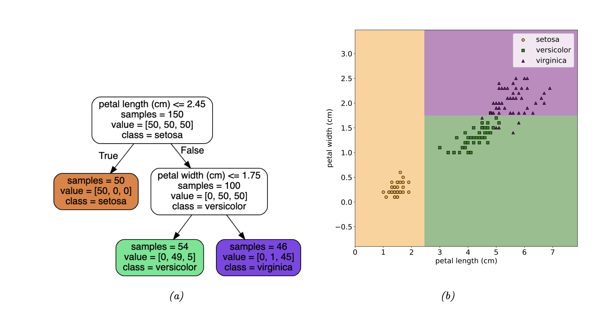

# Probabilistic Machine Learnging: An introduction

Kevin P. Murphy

# 1. Introduction

## 1.1 What is mahcine learning?

> A computer program is said to learn from experience E with respect to some class of tasks T, and performance measure P, if its performance at tasks in T, as measured by P, improves with experience E.

## 1.2 Supervised learning

- the task $T$ is to learn a mapping $f$ from inputs $x \in X$ to outputs $y \in Y$.
- inputs $x$: features, covariates, or predictors. $D$ dimensions($X = R^D$)
- output $y$: label, target, or response.
- The experience $E$: training set. \
  N input-output pairs. $D=\{(x_n,y_n)\}^{N}_{n=1}$ ($N$: sample size)
- The performance measure $P$ depends on the type of output.

### 1.2.1 Classification

- output space: a set of $C$ unordered and mutually exclusive labels known as classes, $Y = \{1, 2, . . . , C\}$
- predicting the class label given an input: pattern recognition
- design matrix
  - dataset of features
  - each row represents an example(data point)
  - each column represents a feature

#### 1.2.1.3 Learning a classifier

- decision rule, decision boundary, decision tree(a), decision surface(2d. b)
  

#### 1.2.1.4 Empirical risk minimization

- misclassification rate: common way to measure performance \
  ${\displaystyle \!L(\theta)={\frac {1}{N}}\sum _{n=1}^{N}I(y_n \neq f(x_n; \theta))}$, where \
  $I(e)={\begin{cases}1&{ if }\quad { e \; \text{is true}}\\
  0&{if}\quad { e \; \text{is false}}\end{cases}}$

- define empirical risk with asymmetric loss function $l(y, \hat{y})$
  ${\displaystyle \!L(\theta)={\frac {1}{N}}\sum _{n=1}^{N}l(y_n , f(x_n; \theta))}$, where \
  $l(y, \hat{y}) = I(y \neq \hat{y})$

- empirical risk minimization
  - finding the parameter that minimizes the empirical risk on the training set
  - ${\hat {\theta}}={\underset {\theta}{\operatorname {arg\,min} }}\,L(\theta)$

#### 1.2.1.5 Uncertainty

- capture uncertainty with conditional probability distribution \
  $p(y=c|x;\theta) = f_c(x|\theta)$, \
  where $f: X \rightarrow [0,1]^C$ map inputs to a probability distribution ove r the C possible output labels. \
  $0 \leq f_c \leq 1$ fore each c, and $\sum_{c=1}^{C}f_c = 1$
- to avoid restriction, use [softmax function](https://en.wikipedia.org/wiki/Softmax_function)
  ${\displaystyle \sigma (\mathbf {z} )_{i}={\frac {e^{z_{i}}}{\sum _{j=1}^{K}e^{z_{j}}}}\ \ \ \ {\text{ for }}i=1,\dotsc ,K{\text{ and }}\mathbf {z} =(z_{1},\dotsc ,z_{K})\in \mathbb {R} ^{K}.}$
- thus with softmax function, define the model as:
  $p(y=c|x;\theta) = S_c(f(x|\theta))$
- if $f$ is an affine function, it is a called logistic regression.
  > Affine functions represent vector-valued functions of the form \
  > $ f(x_1,...,x_n)=A_1x_1+...+A_nx_n+b. $

#### 1.2.1.6 Maximum Likelihood Estimation

- negative log probability is a common choice for loss function \
  $l(y) = - log(p)$
- negative log likelihood(NLL)
  - $NLL(\theta) = - \frac{1}{N} \sum^N_{n=1} log(p(y_n|f(x_n;\theta)))$
  - maximum likelihood estimate(MLE):
    ${\hat {\theta}_{\text{mle}}}={\underset {\theta}{\operatorname {arg\,min} }}\,NLL(\theta)$

### 1.2.2 Regression

- regression: predict a real-valued quantity $y \in \mathbb{R}$
- common choice
  - loss function: quadratic loss($l_2$ loss) \
    $l_2(y, \hat{y}) = (y - \hat{y})^2$
  - empirical risk: MSE(mean square error)
    $\text{MSE}(\theta) = \frac {1} {N}\sum_{n=1}^{N} (y_n - f(x_n ;\theta))^2$
  - output: gaussian
  - linear model induces an MSE$(\theta)$ that has a unique global optimum
    - polynomial regression is linear to $w$
    - $\phi(x) = [1, x, x^2, ..., x^D]$
    - $f(x;w) = w^T\phi(x) = w_0, + w_1x_1 + w_2x_2 + w_3x_1^2 +...$
  - Deep Neural Network: $f(x;\theta) = f_L(f_{L-1}( ... (f_1(x)...))$

### 1.2.4 No free lunch theorem

there is no best model that fits in all kinds of problem.

## 1.3 Unsupervised learning

- just have inputs without outputs

### 1.3.1 Clustering

- goal: to partition the input into regions with similar points

### 1.3.2 Discoverint latent factor of variation

- assume that input $x_n \in \mathbb{R}^D$ are generated from some
- latent factors $z_n \in \mathbb{R}^K$
- factor analysis: simple assumption. linear model \
  $p(x_n | z_n;\theta) = N(x_b|Wz_n + \mu, \Sigma)$.
- if $\Sigma = \sigma^2 I$, then PCA
- nonlinear model, $p(x_n | z_n;\theta) = N(x_b|f(z_n;\theta), \sigma I)$. \
  ex) variational autoencoder

### 1.3.3 Self-supervise Learning

- create proxy supervised tasks from unlabeled data. \
  ex) learn color image from grayscale image, mask out words from sentecne and predict them

### 1.3.4 Evaluating unsupervised learning

- hard to evaluate the quality of the output since there is no ground truth
- common method: measure the probability assinged by the model to unseen test set. (By negative log likelihood) : density estimation.
- alternative approach: test with downstream task. \
  if unsupervised learning is successful, it should perform well with supervised learning.

## 1.4 Reinforcement Learning

- the system or agent has to learn how to interact with its environment
- learn policy $a = \pi(x)$ : action to take in response to input x
- reward instead of output

## 1.5 Data

### common dataset

- image: MNIST, EMNIST, Fashion-MNIST, CIFAR, ImageNet
- text:imdb movie review, WMT dataset

### 1.5.3 Preprocessing discrete input data

- one-hot encoding
- feature crossess

### 1.5.4 Preprocessing discrete text data

- bag of words
- TF-IDF
- word embedding
- dealing with novel words
  - Out of Vocabulary(OOV)
  - replace with UNK("unknown")
  - user substrcture to infer the meaning
- handling missing data

  - notation

    - Let $M$ be an $N \times D$ matrix of binary variables, where $M_nd = 1$ if feature $d$ in example $n$ is missing, and $M_nd = 0$ otherwise.
    - $X_h$: missing part corresponding to $M_nd = 1$
    - $Y$: output label matrix

  - missing complemtely at random(MCAR): $p(M|X_v, X_h, Y) = p(M)$
  - missing at random(MAR): $p(M|X_v, X_h, Y) = p(X_v, Y)$
  - not missing at random(NMAR) : need to model missing data mechanism

# 2. Probability: Univariate Models

## 2.1 Introductoin

### 2.1.1 What is probability?

- frequentist: probabilities represent long run frequencies of events that can happen multiple times
- bayesian: probability is used to quantify our uncertainty about something.

### 2.1.2 Types of uncertainty

- model uncertainty(epistemic uncertainty): not knowing hidden cause or mechanism generating the data
- data unceratinty(aleatoric uncertanty): uncertainty that arises from intrinsic variabilty which can not be reduced with more data.
