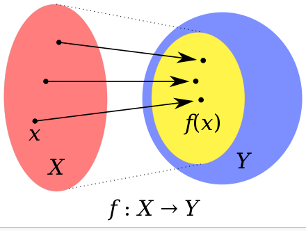
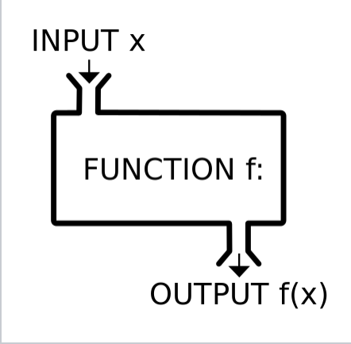

# Monad

## Intro

### Definition

> ### Wikipedia)
>
> Given any well-defined, basic types T, U, a monad consists of three parts:
>
> - A type constructor M that builds up a monadic type M T[b]
> - A type converter, often called unit or return, that embeds an object x in the monad:
>   - unit : T → M T[c]
> - A combinator, typically called bind (as in binding a variable) and represented with an infix operator >>= or a method called flatMap, that unwraps a monadic variable, then inserts it into a monadic function/expression, resulting in a new monadic value:
>   - (>>=) : (M T, T → M U) → M U[d] so if mx : M T and f : T → M U, then (mx >>= f) : M U

> https://en.wikipedia.org/wiki/Monad_(functional_programming)#Definition

<details> <summary> 네? </summary>


</details>

</br>

### 좀 더 쉬운 설명

> Monads represents a specific form of computation, along with two procedures
>
> - One to **wrap values** of any basic type within the monad (yielding a monadic value);
> - Another to **compose functions** that output monadic values (called monadic functions).

- 함수를 조합/합성하는 방법을 추상화한 것
- 함수형 프로그래밍의 주요 개념

</br>

---

## Why monad?

### Functional programming

- 함수로 프로그래밍 하는 것
- 함수를 조합해서 프로그래밍 하는 것(apply and compose)
- declarative programming paradigm (선언적 프로그래밍 사고방식) \
  with trees of functions that map values to other values

  > rather than \
  > a sequence of imperative statements \
  > which update the running state of the program.

- function as data

### 예시

- imperative programming

  ```js
  const numList = [1, 2, 3, 4, 5, 6, 7, 8, 9, 10];

  let result = 0;
  for (let i = 0; i < numList.length; i++) {
    if (numList[i] % 2 === 0) {
      result += numList[i] * 10;
    }
  }
  ```

- functional programming

  ```js
  const result = [1, 2, 3, 4, 5, 6, 7, 8, 9, 10]
                  .filter(n => n % 2 === 0)
                  .map(a => a \* 10)
                  .reduce((a, b) => a + b);
  ```

<details> <summary> FP vs. OOP </summary>

| Functional Programming                                      | OOP                                           |
| ----------------------------------------------------------- | --------------------------------------------- |
| Immutable data.                                             | Mutable data.                                 |
| Declarative Programming based Model.                        | Imperative Programming Model.                 |
| "무엇"을 하는가.                                            | "어떻게" 하는가                               |
| Yes Parallel Programming.                                   | No Parallel Programming.                      |
| 함수: no-side effects.                                      | 함수: possibly 많은 side effects.             |
| Flow Control: function calls & with recursion.              | Flow control: loops & conditional statements. |
| 실행순서: not 중요.                                         | 실행순서: 중요.                               |
| Both “Abstraction over Data” & “Abstraction over Behavior.” | Only “Abstraction over Data”.                 |

> https://www.tutorialspoint.com/functional_programming/functional_programming_introduction.htm

</details>

</br>

### FP의 주요 개념

- 함수는 1급 시민(First Class Citizen, 1급 객체)
  - 함수를 일반 데이터처럼 다룰 수 있다.
  - ex
    - argument로 전달하기
    - 함수의 반환값으로 사용하기 (return)
    - 변수에 할당
- pure function(순수 함수)
  - 동일한 입력 -> 동일한 반환값
  - no side effects (state/global variable을 바꾸지 않는다)

### 수학의 함수 vs. 컴퓨터 공학의 함수

- 수학

  - 집합 X의 원소 x 한 개에 집합 Y의 원소 y 한 개가 대응하는 관계

    
    \
    

- 컴퓨터 공학

  ```js
  function f(x) {
    return x + 3;
  }
  ```

  ```js
  const a = 3;
  function g(x) {
    return x + a; // referencing external value
  }
  ```

  ```js
  let a = 2;
  function h(x) {
    a += 1; // side effect!!!
    return x + a;
  }
  ```

### Why monad?

- Functional programming은 state가 없지만, monad를 이용하여 비슷한 효과를 낼 수 있다.

</br>

## What is monad?

- function -> monoid -> monad

### Function

- x: int
  > int x; \
  > $x \in$ int
- f: int -> int
  > int를 받아서 int를 반환하는 함수

---

any type: a \
(generic type처럼 생각할 수 있음)

```java
# T 자리에 a
public class Box<T> {
    // T stands for "Type"
    private T t;

    public void set(T t) { this.t = t; }
    public T get() { return t; }
}
```

- x: a
- f: a -> a
- g: a -> a

---

### Monoid

- f와 g를 조합하는 방법?
- g(f(a)) 또는 f(g(a))
  > a는 변수 이름이 아니라 a type의 변수를 의미
- better notation

  - f(a)를 fa로 표시합니다.
  - $(f \circ g) a = f(g(a))$

- $h = (f \circ g)$ \
  then, h: a -> a

---

- 동일한 type을 조합해서 동일한 type을 만드는 것 \
  아래 예시에서 함수가 monoid입니다.

  - 동일한 input type
    - f: a -> a
    - g: a -> a
  - 동일한 output type
    - h: a -> a
  - 간단한(작은) 것으로 복잡한 것을 만들 수 있다.
  - 항상 type이 정해진다.( f, g를 조합하면 항상 a -> a의 함수가 만들어진다) \
    실수할 수가 없다.

- formal definition

  - > A set S with a binary operation. S × S → S. •
    >
    > - Associativity: $ \forall a, b, c \in S, (a • b) • c = a • (b • c)$
    > - Identity: $\exists e \in S$ such that $\forall$ a in S,
    >   e • a = a, a • e = a

- 적용해보면,

  - Associativity
    - $(h \circ f) \circ g = h \circ (f \circ g)$
  - Identity:
    - $f \circ id = f$
    - $id \circ f = f$

- 예시 \
  시계 \
  binary operation $\otimes$ : (x + y) % 12

  - 11 $\otimes$ 2 = 1
  - 15 $\otimes$ 5 = 8
  - (11 $\otimes$ 4) $\otimes$ 6 = 9 \
    11 $\otimes$ (4 $\otimes$ 6) = 9
  - 6 $\otimes$ 12 = 6 \
    12 $\otimes$ 6 = 6
  - x $\otimes$ 12 = x \
    12 $\otimes$ x = x \
    (즉, id = 12)

- 함수가 아래 규칙을 만족하는지 보이자,

  - Associativity: $(h \circ f) \circ g = h \circ (f \circ g)$
    - $((h \circ f) \circ g) a= h(f(ga)$
    - $(h \circ (f \circ g)) a= h(f(ga)$
  - Identity:
    - $(f \circ id) a = f(id(a)) = f(a)$
    - $(id \circ f) a = id(f(a)) = f(a)$
  - 따라서 a -> a의 함수는 monoid이다.

---

### Monad

- f: a -> Ma
- g: a -> Ma
- h: a -> Ma

> - M: type constructor
> - Ma: type M의 constructor를 a에 적용하는 것 (function call)
> - M : arbitrary side effect(IO, exception, ...)

---

#### M ???

- Wrap `a`
- ex) promise, list, ...
- ex) g(x,y) = x / y

  - y가 0이면 exception이 발생한다.
  - haskell Maybe monad

    ```haskell
    data Maybe a = Nothing | Just a
    country = Just "Korea"
    ```

  - g(x,y) = x / y
    ```python
    if y == 0: return Nothing
    else: return Just x/y
    ```
  - a -> a 로는 충분하지 않기 때문에 \
    side effect M을 연산에 포함시켜서 a -> Ma 이용

---

- functional programming: 함수를 조합/합성해서 프로그래밍하는 것
- monad의 3요소

  - type constructor `M`
    - a type of computation
  - type converter `unit`(`unit: a -> M a`) (`return` function)
    - create primitive value of that computation type
  - combinator `bind` (`>>==: (Ma, a -> Mb) -> Mb`)
    - 여러 함수를 어떻게 합성할지?
    - combines computations of that type together to make more complex computations of that type

- container에 비유하면
  - type constructor `M`: value를 담는 container
  - `M a`: type `a`의 value를 담는 container
  - `return function`: value를 monad container에 담는다.
  - `>>= function`: monad container에서 value를 꺼내서 \
    새로운 값을 담는 monad container를 생성하는 함수에 전달한다 \
    (다른 type일 수 있음)

---

[with drawings](https://adit.io/posts/2013-04-17-functors,_applicatives,_and_monads_in_pictures.html#just-what-is-a-functor,-really?)

---

```haskell
-- the type of monad m
data m a = ...
```

- `Stream<a>`
- `Optional<a>`

```haskell
-- return takes a value and embeds it in the monad.
return :: a -> m a
```

- `someList.stream()`
- `Optional.of("hi")`
- `Optional.empty()`
- `Optional.ofNullable(someStr)`

```haskell
-- bind is a function that combines a monad instance m a with a computation
-- that produces another monad instance m b from a's
-- to produce a new monad instance m b
(>>=) :: m a -> (a -> m b) -> m b
```

- `someList.stream().map(s => s.toUpperCase())`

---

## Maybe Monad

- value or nothing
- like `Optional`

```haskell
data Maybe a = Nothing | Just a
country = Just "Korea"
```

```haskell
safediv :: Int -> Int -> Maybe Int
safediv n m = if m == 0 then Nothing
 else Just (n / m)
```

```haskell
case ... of
  Nothing -> Nothing
  Just x  -> case ... of
               Nothing -> Nothing
               Just y  -> ...

```

```haskell
data Maybe a = Nothing | Just a
 country = Just "China"

instance Monad Maybe where
  return = Just
  Nothing >>= f = Nothing
  (Just x) >>= f = f x

```

---

## Sheep Monad

- natural sheep or cloned sheep

```haskell
type Sheep = ...

father :: Sheep -> Maybe Sheep
father = ...

mother :: Sheep -> Maybe Sheep
mother = ...
```

```haskell
maternalGrandfather :: Sheep -> Maybe Sheep
maternalGrandfather s = case (mother s) of
                          Nothing -> Nothing
                          Just m  -> father m
```

```haskell
mothersPaternalGrandfather :: Sheep -> Maybe Sheep
mothersPaternalGrandfather s = case (mother s) of
                                 Nothing -> Nothing
                                 Just m  -> case (father m) of
                                              Nothing -> Nothing
                                              Just gf -> father gf
```

```haskell
-- comb is a combinator for sequencing operations that return Maybe
comb :: Maybe a -> (a -> Maybe b) -> Maybe b
comb Nothing  _ = Nothing
comb (Just x) f = f x

-- now we can use `comb` to build complicated sequences
mothersPaternalGrandfather :: Sheep -> Maybe Sheep
mothersPaternalGrandfather s = (Just s) `comb` mother `comb` father `comb` father
```

---

## List monad

```haskell
instance Monad [] where
    m >>= f  = concatMap f m
    return x = [x]
    fail s   = []

instance MonadPlus [] where
    mzero = []
    mplus = (++)
```

> fail s = error s

concatMap:
http://zvon.org/other/haskell/Outputprelude/concatMap_f.html

```haskell
-- we can parse three different types of terms
data Parsed = Digit Integer | Hex Integer | Word String deriving Show

-- attempts to add a character to the parsed representation of a hex digit
parseHexDigit :: Parsed -> Char -> [Parsed]
parseHexDigit (Hex n) c = if isHexDigit c then
                            return (Hex ((n*16) + (toInteger (digitToInt c))))
                          else
                            mzero
parseHexDigit _       _ = mzero

-- attempts to add a character to the parsed representation of a decimal digit
parseDigit :: Parsed -> Char -> [Parsed]
parseDigit (Digit n) c = if isDigit c then
                           return (Digit ((n*10) + (toInteger (digitToInt c))))
                         else
                           mzero
parseDigit _         _ = mzero

-- attempts to add a character to the parsed representation of a word
parseWord :: Parsed -> Char -> [Parsed]
parseWord (Word s) c = if isAlpha c then
                         return (Word (s ++ [c]))
                       else
                         mzero
parseWord _        _ = mzero

-- tries to parse the digit as a hex value, a decimal value and a word
-- the result is a list of possible parses
parse :: Parsed -> Char -> [Parsed]
parse p c = (parseHexDigit p c) `mplus` (parseDigit p c) `mplus` (parseWord p c)

```

---
