# Table of Contents

- [Chapter 1. Microservice Security Landscape](#chapter-1)
  - 1.1 How security works in a monolithic application
  - 1.2 Challenges of securing microservices
  - 1.3 Key Security fundamentals
  - 1.4 Edge Security
  - 1.5 Securing service-to-service communication
- [Chapter 2. Fist steps in securing microservice](#chapter-2)
- [Chapter 3. Securing north/south traffic with an API gateway](#chapter-3)
  - 3.1 The need for an api gateway in a microservice deployment
  - 3.2 Security at the edge(why OAuth 2.0?)
  - 3.3 Setting up an API gateway with Zuul
  - 3.3 Setting up an API gateway with Zuul
- [Chapter 4. Accessing a secured microservice via a single-page application](#chapter-4)
  - Architecture of SPA(appendix)
  - Authentication flow of SPA(appendix)
  - With single/multi trust domains(appendix)
- [Chapter 5. Engaging throttling, monitoring, and access control](#chapter-5)

  - 5.1 Throttling at the API gateway with Zuul
  - 5.2 Monitoring and analytics with Prometheus and Grafana
  - 5.3 Enforcing access-control policies at the API gateway with Open

- [Chapter 6. Securing east/west traffic with certificates](#chapter-6)

  - 6.1 Why use mTLS?
  - 6.5 Challenges in key management

- [Chapter 7. Securing east/west traffic with JWT](#chapter-7)
  - 7.1 Use cases for securing microservices with JWT
- [Chapter 8. securing east/west traffic over gRPC](#chapter-8)
  - skipped
- [Chapter 9. Securing reactive microservices](#chapter-9)

  - 9.1 Why reactive programming?
  - 9.x securing with kafka, NATS

- [Chapter 10. Conquering container security with docker](#chapter-10)

  - 10.2 Managing secrets in a Docker container
  - 10.3 Using Docker Content Trust to sing and verify Docker image
  - 10.5. Running containers with limited privileges
  - 10.6 Running Docker Bench for security
  - 10.7 Securing access to the Docker host

- [Chapter 11. Securing microservices on Kubernetes](#chapter-11)
  - 11.2,3 configmap, secret
  - 11.6 user account, service account
  - 11.7 role-based access control in Kubernetes
- [Chapter 12. Securing microservices with Istio service mesh](#chapter-12)
  - in progress

---

## Chapter 1. Microservice Security Landscape 

### 1.1 How security works in a monolithic application

- The servlet filters authenticates the request, and adds user information in the web session.
- The inner components assume that the request is valid.
  --The security is controlled centrally

### 1.2 Challenges of securing microservices

- More entry point, more points to be protected
  - mono: one entry point, in-process call on one jvm
  - micro: many entry points(each one has its own). in-process call -> remote call
- distributed security screening -> poor performance
  - monolithic: security check once
  - mociroservice: repetitive check(w/ remote security token service) \
    -> redundant checks, performance issue
- deployment complexities
  - each microservice need certifiacte which is used in authentication. Need way to revoke and rotate certificates
- hard to trace the request
  - three pillars of observability: log, metrics, traces
  - request may go through multiple microservices before leaving the system since it enters.
- conatiners are immutable, but allowed clients are dynamically decided.- - store access-control policy in different server(the policy administration end-point)
  - push model: the policy administration end-point pushes policy updates to the interstes mocioservices
  - pull model: each microservice polls the policy administration end-point
  - certificate should be rotated, injected when the service boots up
- sharing user context is hard since distributed
- polyglot architecture -> each one use different tech stack

### 1.3 Key Security fundamentals

- Authentication: identify-the request party
  - clarify the audience first
  - system delegates human user: OAuth 2.0
  - authenticate human user: MFA(Multi Factor Authentication) ex) OTP, FIDO(Fast-Identity-Online)
  - authenticate system: certificates, JWT
- Integrity: check if the data is not modified
  - data in transit: sing-in. ex) TLS, https
  - data in rest: audit trailing, periodically calculate message digest of audit trail, encyrpt, and store securely
- nonrepundiation: the microservice can not deny that he didn't-do the transaction
  - digital signature, record of signature and timestamp
- confidentiality- protect from uninteded disclosure
  - when hijacked, data should not be understandable
  - encryption. However, it is expensive
  - data in transmit: ex) TLS \
    with proxy server,
    - TLS bridging- proxy server terminates TLS connection and creates a new one. Data is readable in the proxy server.
    - TLS tunneling: proxy server creates a tunnel. Data is unreadable in the proxy server.
  - data in rest: database
- availiability: the system should be running, no matter what
  - Security takes a key role in making system constantly available to stakeholders
  - firewall, api gateway
- authorization: do you have a permission?

### 1.4 Edge Security

- role of API Gateway
  - expose a selected set of microservices to the outside world-as API
  - build quality-of-service(QoS) features(security, thorttling, analytics)
- authentication
  - certificate-based: server to server. mTLS
  - Oauth 2.0: human(delegate to server) to system
- authorization
- passing client/user context to upstreaam microservices: http header, jwt

### 1.5 Securing service-to-service communication

- service-to-service communication
  - synchornous: http
  - asynchronous: message queue
- service-to-service authentication
  - trust the network
    - old-school model
    - no security
    - opposite of zero-trust network(every request is checked)
  - mTLS
    - transport layer
    - each microservice carries public/private key
  - JWT
    - application layer
    - JWT includes claims and signed by the issuer. \
      issuer can be STS or the micrsoervice itself
    - works over TLS
- service-level auhtorization
  > PDP(Policty Decision Point)
  - centralized PDP model
    - access-control policies are defined, stored, and evaluated centrally
    - to authenticate, need to talk to the endpoint
    - create dependency on the PDP and increase latency \
      caching can decrease latency
  - embedded PDP model
    - policies defined centrally but stored and evaluted at the service level
    - the challenge: how to update policy from the centralized policy administration point(PAP)
      - poll or push
      - since servers load policies when boot, the service should restart to reload. -> overkill
- propagating user context among microservices
  - http header: can be modified
  - JWT issued by calling service: calling service can lie th euser context
  - JWT issued by external STS: most secure
- crossing trust boundaries

  - w/o api gateway between trust domain

    1. api gateway -> order processing service with jwt signed by the gateway, aud: order processing service
    2. order processing microservice -> STS of foo domain.
    3. foo STS returns new JWT signed by it, aud: STS of bar
    4. and 5. order processing microservice -> STS of bar, get new JWT signed by STS of bar, aud: delivery microservice
    5. order processing microservice access declivery microservice
       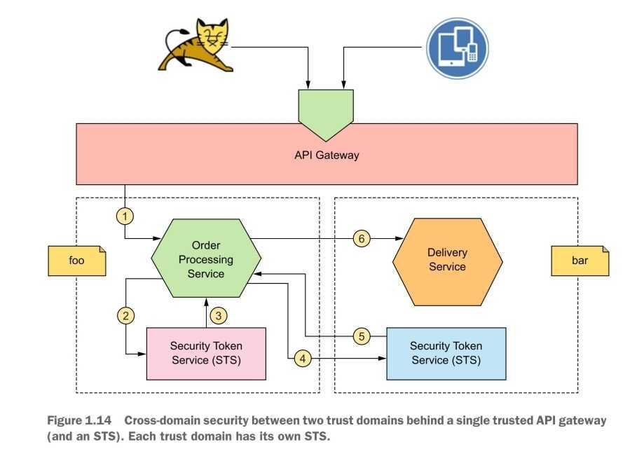

  - w api gateway between trust domain
    1. api gateway -> order processing service with jwt signed by the gateway, aud: order processing service
    2. order processing microservice -> STS of foo domain.
    3. foo STS returns new JWT signed by it, aud: apigateway of the bar
    4. order processing microservice -> api gateway of bar
    5. api gateway of bar -> STS of bar \
       bar STS creates jwt with aud: delivery microservice
    6. api gateway of bar -> delivery microservice
       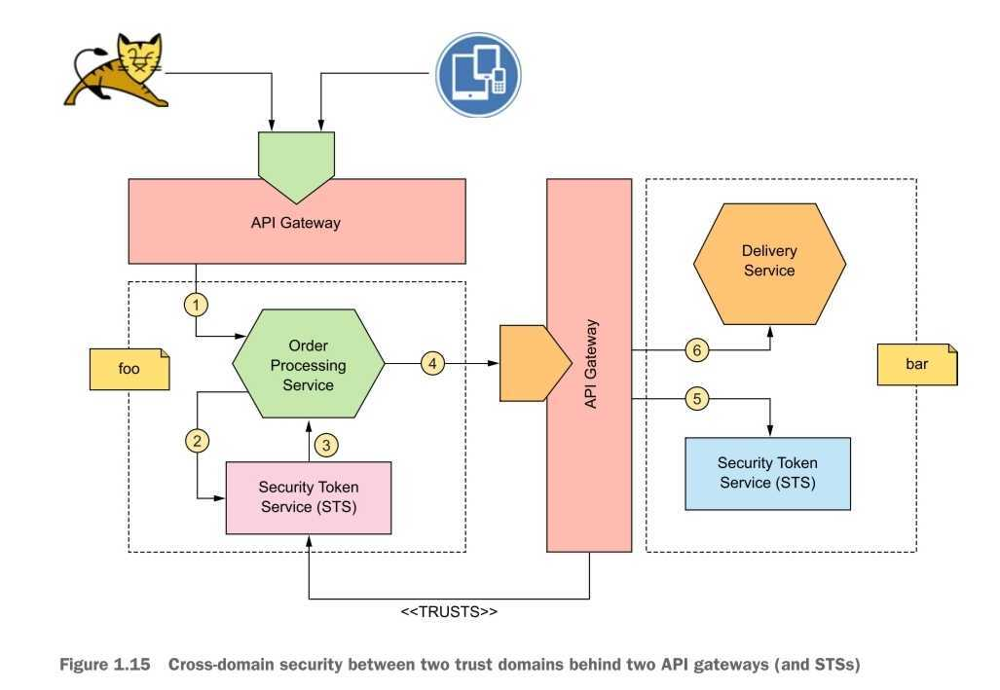.

## Chapter 2. Fist steps in securing microservice 

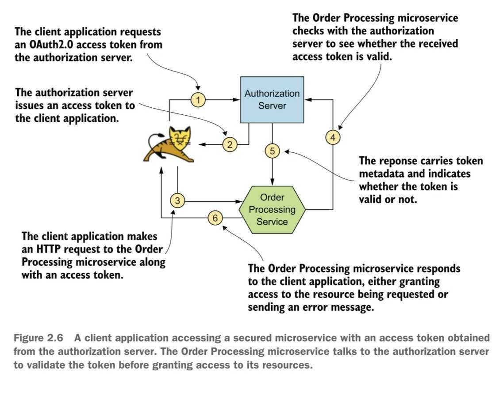.

## Chapter 3. Securing north/south traffic with an API gateway 

> - north/south traffic
>   - edge security \
>     (protecting a set of resouces at the entrypoint to the deployment, at the API gateway)
>   - api gateway pattern
> - east/west traffic
>   - service-to-service security
>   - service mesh pattern

### 3.1 The need for an api gateway in a microservice deployment

- Decoupling security from the microservice
  - Change of security protocol require changes in the microservice
  - Scaling up the microservice results in more connecdtions to the authorization server
- Consistent interface while microservices may be inconsistent. \
  (microservices tend to have diverse tech stack, complex structures)
- hide inner-structure
  - in some cases, read happens much more than writes
  - with api gateway, we can divide read-service and write service but maintain the identical-entrypoint.

### 3.2 Security at the edge(why OAuth 2.0?)

- diverse consumers: internal, external, hybrid applications-- delegating access: client application access on behalf user
- why not basic authentication?
  - username and password are static, long-living
  - no scope check
- why not mTLS?
  - has expiration, which solves basic athentication's problem but...
  - no access delegation
- Why OAuth 2.0?
  - who: only permitted entities
  - what purpose: scope
  - how long: ensure that access is granted for desired period

### 3.3 Setting up an API gateway with Zuul

- Firewall blocks the direct access from client application to microservice/authorization server
- JWT
  - Authroization server is hard to scale but, recieves many requests.
  - If access token contains information needed for authentication, we can solve this problem.
  - pitfalls of self-validating-token
    - no way to revoke prematurely
      - solution1: short-lived JWT
      - solution2: inform the API gateway of the revoked tokens
    - certificate used to verify a token signature might have expired. \
      then, JWT can no longer be verified.
      - solution1. deploy the new certificate when renewed
      - solution2. provision the ceritifacte of the CA(certificate authority) of the token issuer.

### 3.3 Setting up an API gateway with Zuul

- preveneting access with the firewall
- use mTLS in communcation between the api gateway and microservices

## Chapter 4. Accessing a secured microservice via a single-page application

### Architecture of SPA(appendix)

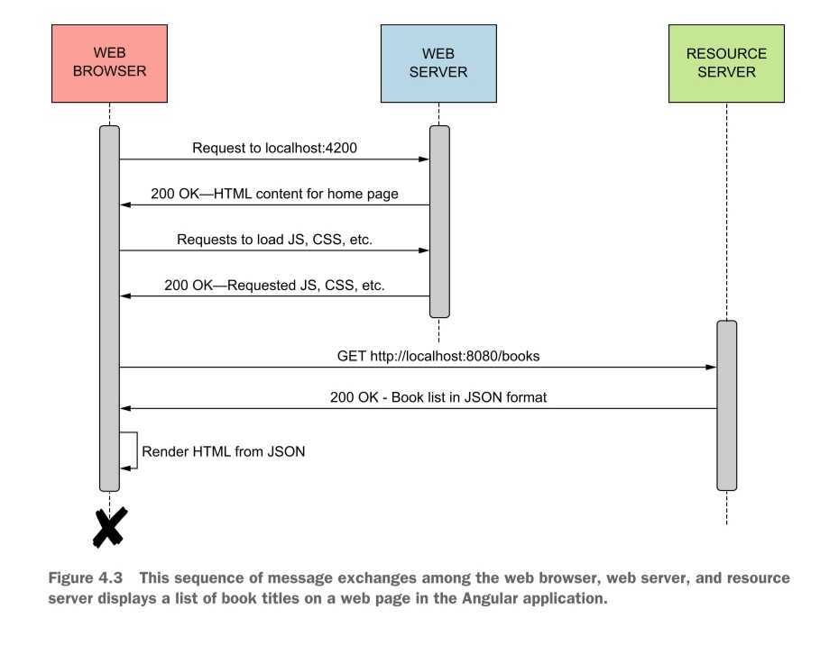

### Authentication flow of SPA(appendix)

- authentication flow

  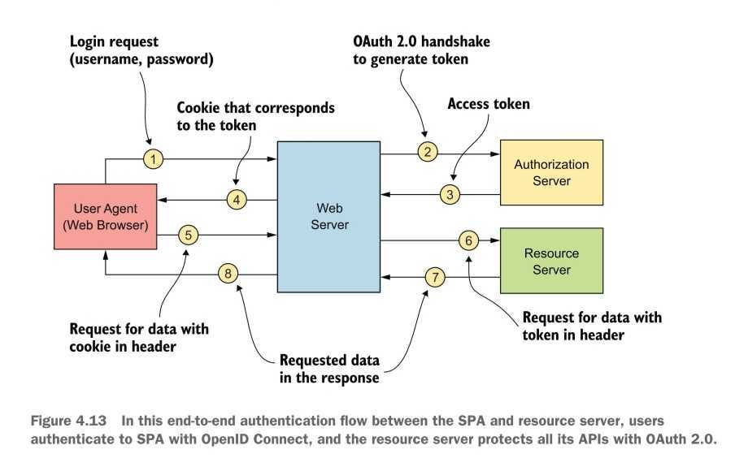

- with webserver

  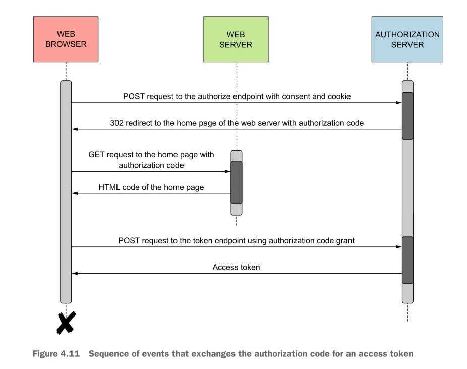

- with resource server

  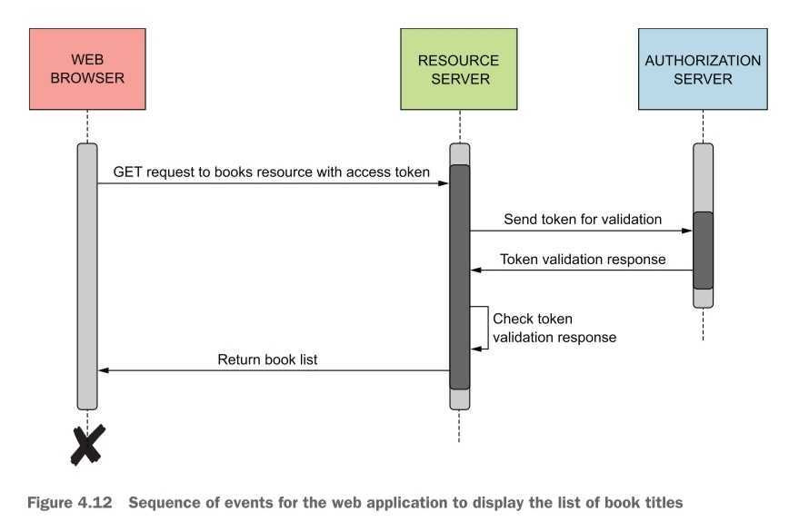

### With single/multi trust domains(appendix)

- The client application(SPA), authorization server, and resource server need to be in the same trust domain.

  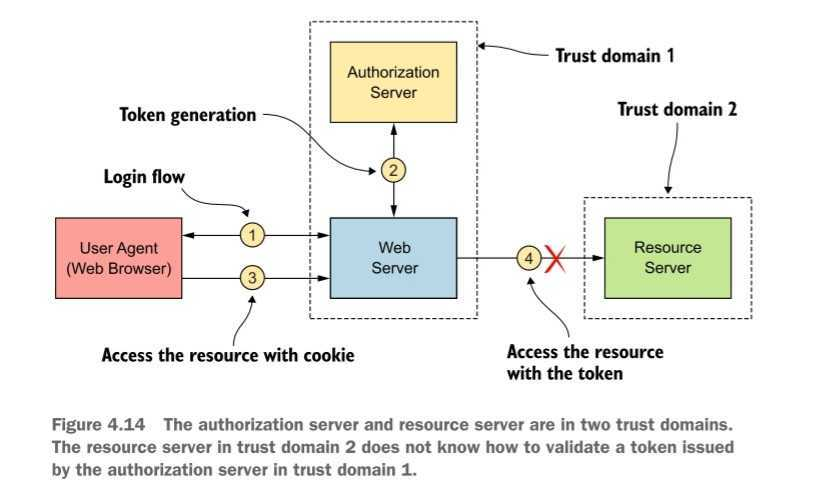

- To build trusts between multiple trust domains,
  - web server should exchange token from authorizations to the one for domain2.
  - in case of JWT, JWT bearer grant type accepts a JWT, validates-it, and issues a valid OAuth-2.0 token(whic is another JWT or opaque token string)
    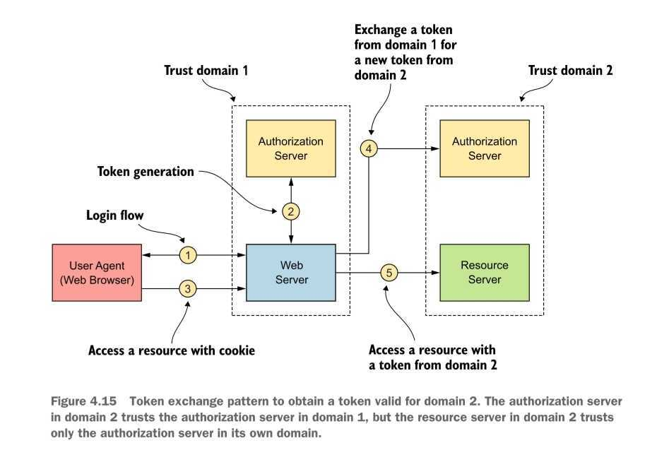

## Chapter 5. Engaging throttling, monitoring, and access control 

> Throttling \
> a. the suppression or prevention of an activity \
> b. the activity or process of limiting the bandwidth available-to users of an electronic communication systems (such as the Internet) \
> referenced: merriam-webster dictionary

### 5.1 Throttling at the API gateway with Zuul

- scaling is not free. \
  Also, there is a physical limit on how much we can scale the system. \
  Thus limiting the number of requests(throttling) is needed.
- basic notion: count the number of requests and if exceeds the limit, block
  - Quota-based
    - provide each-application a quota
    - identify-application with client-id which-can be retrieved from auth server with access token
  - fair usage policy for user
    - in case of multiple users per application, ex) 20 users on one application
    - ex) JWT, use sub claim to identify-user
- set maximum threshold limit
- operation level throttling
  - Single api may have two microservices. One for read, the other for write.
  - Throttling may be required on operation-level
- Throttling the OAuth 2.0 token and authorize endpoints
  - Throttling on auth server api is hard, since the requests are preauthenticated, which means we can identify-the source of the request
  - Only ip is available, and it is out of the handling scope of the api gateway. Instead, deal with firewall
- privilege-based throttling
  - highger priviliege may have more quota

### 5.2 Monitoring and analytics with Prometheus and Grafana

- prometheus pulls metrics data from microservice periodically
- Also, it has a push-gateway for short-lived process, to send-data before prometheus polls

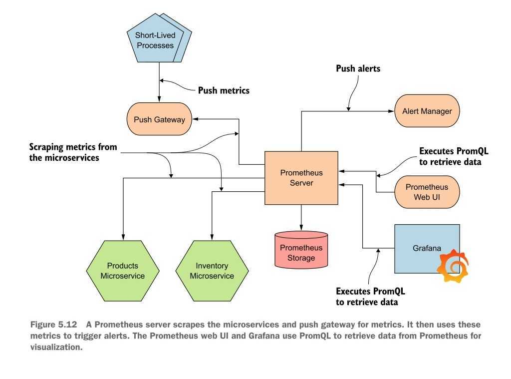

### 5.3 Enforcing access-control policies at the API gateway with Open Policy Agent

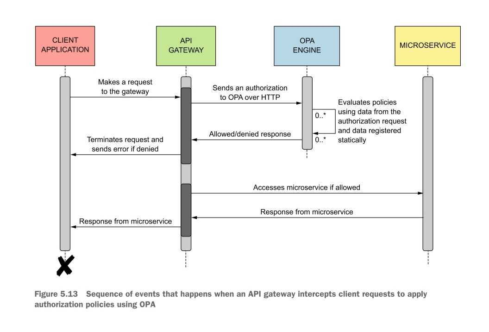

## Chapter 6. Securing east/west traffic with certificates 

### 6.1 Why use mTLS?

- TLS
  - with tls, no one in the middle-can see what it is
  - client application can identify-the server that it communicates with
  - the server should have valid certificate-that is trusted by all the client applications
- CA(certificate authority)
  - A third party that signs the certificate given to the service
  - Few trusted CA exist, their public keys are embedded in all browsers
  - browser can verify that the service's certificate is valid by-verifying the signature against the CA's public key.
- mTLS
  - both server and client msut have valid certificate-and trust corresponding certificates.
  - secure communications between microservices

### 6.5 Challenges in key management

- bootstraping trust
  - have a single CA, and each microservice trust this CA
- provisioning key/certificates to workloads or microservices
  - typical key-provisioning process at an enterprice
    - generate public/private key pair
    - create a certificate signing request(CSR) & submit
    - when acepted, deploy the certificate and the keys to the microservice
  - at netflix
    - short-lived credential
  - generating long-lived credentials
    - netf
  - SPIFFE
    - SPIFFE(Secure Production Identity-Framework For Everyone): open standard that defines a way a microservice can establish an identity- - SPIFFE Runtime Environment: open source reference implementation of SPIFFE
- key revocation

  - cases
    - private key is compromised
    - CA's private key is compromised
    - the detail of CSR is invalid
      --certificate does not represent the original entity at the time the certificate was issued.
  - CRL(certificate revocation list): old way, up to TLS client's application
  - OCSP(Online Certificate Status Protocol)
    - tls client asks to the OCSP end point if the certificate is revoked, every time it sees.
    - increase client-side latency- - unclear if the response contain updated revocation information. cached response
    - response can be faked, filtered, etc.
    - privacy risk. OCSP responder knows end user
  - OCSP stapling
    - server recieves the staple from the OCSP end point and attach it when it responds to the client
  - short-lived certificate
    - only rely on expiration
    - short-lived certificate is in-memory thus cheap, \
      whereas loading long-lived certificate is expensive
    - netflix uses a layered approach \
      during bootup, use long-lived credentials, then each microservice get short-lived credentials using the long-lived credentials
      

- key rotation

  - key rotation interval depends on the expiration time.
  - keys embedded in the microservices can be short-lived and rotated frequently, but CA's private key doesn't need to be.
  - upating CA's private key has high overhead. All the microservices should have the updated key. \
    Neflix uses TPM and SGX.
  - automation is required. \
    SPIFFE is one of the solutions.

- monitoring key usage
  - logging, metrocs, tracing

## Chapter 7. Securing east/west traffic with JWT 

### 7.1 Use cases for securing microservices with JWT

- two goals:

  - secure service-to-service communications
  - pass end-user context across microserves

- shared JWT

  - when identity-of the end user is needed in access control, and the microservice isn't relevant
  - need to carry user context on every request
  - still, JWT with mTLS is better option.(double defense)
  - how
    - STS authenticates the reqeust once, returns new JWT
    - this JWT is used acroos all requests
    - the microservice validated-JWT by itself.

  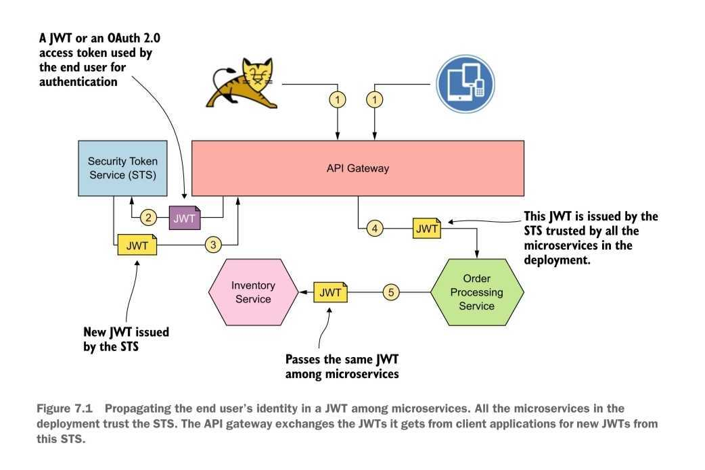

- new JWT for each service-to-service interaction

  - how: generate new JWT for each service interaction
    - when recieve request, the microservice authenticates JWT by itself.
    - before send request to other microservice, create new JWT with STS.(4.a, 4.b)
    - field to care in token exchgange request: subject_token_type, grant_type \
      ex)[google Oauth2.0 token exchange parameter](https://cloud.google.com/iam/docs/reference/sts/rest/v1beta/TopLevel/token)
  - why this approach?

    - We can put the target microservice in the JWT's audience field. It explicits who the intended audience is.
    - STS is a better place to control access than microservice itself. \
       STS always knows who initiated the token exchange and the callee of the request.

  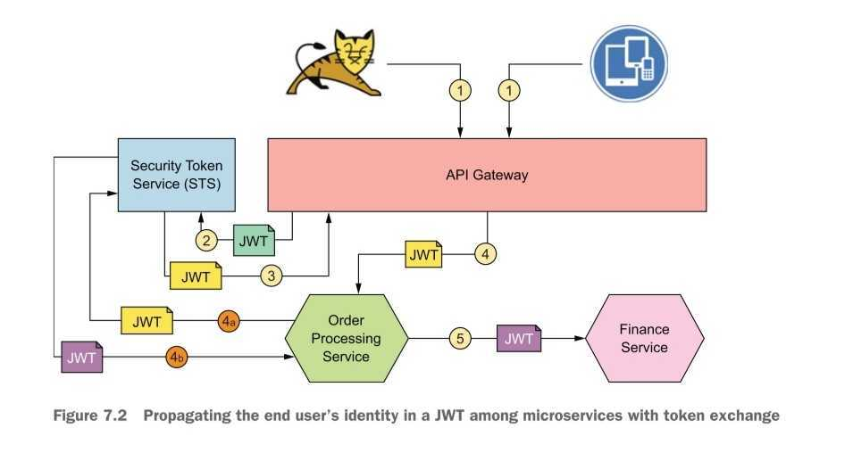

- new JWT for microservices between different trust domain

  - how
    - api gateway in target trust domain authenticates the token with that domain's STS(step 8) \
      target domain's STS should trust source domain's STS
    - target trust domain's STS returns new STS(step 9)

  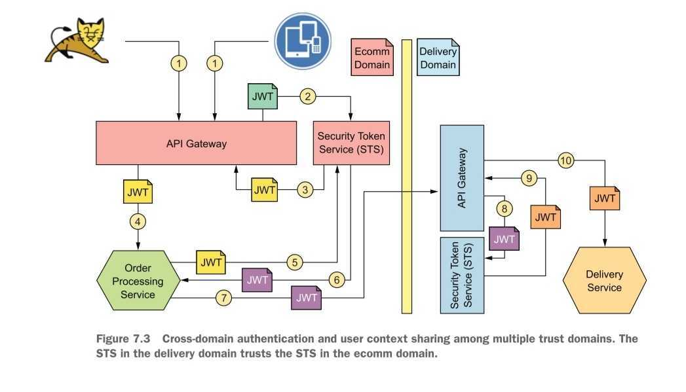

- self-issued JWT

  - how
    - previously, JWT was issued by trusted STS. Thus to authenticate the token, STS's public key was required.
    - self-issued JWT is generated by each microservice with its own private/public key.
    - self-issued JWT is passed as an http header over tls. \
      The reciever validates-wih the public key of the sender.
  - mTLS vs. self-issued JWT
    - self-issued JWT ~ mTLS(on a par) : when used only for authenticating between services.
    - self-issued JWT > mTLS: when sharing contextual data.
    - mTLS
      - provides:-confidentiality-and integrety of the data in transit
      - not provides:-nonrepudiation
    - self-issued JWT is signed with issuer's private key \
       -> provides repundiation- > bearer token: anyone who steals a bearer token an use it without any problem until the token expires.

- nested JWT

  - JWT that embeds another JWT. extension of self-issued JWT
  - inner JWT is signed with STS's private key. \
    outer JWT is signed by the sender's private key.
  - it holds the identity-of the end user and the calling microservice

  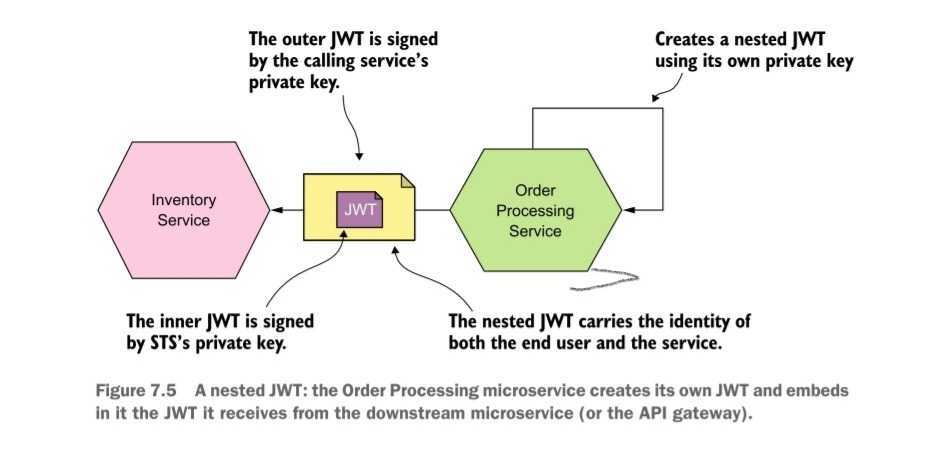

## Chapter 8. securing east/west traffic over gRPC 

skipped

## Chapter 9. Securing reactive microservices 

### 9.1 Why reactive programming?

- loose coupling between the source microservice and the target microservice.

### 9.x securing with kafka, NATS

- often use message broker: kafka, NATS
- security check
  - only trusted service can talk to kafka: mtls \
    with tls, any client can talk to kafka
  - control access to topics: ACL \
    kafka provides acl-control

## Chapter 10. Conquering container security with docker 

- The security of a microservice deployment should be thought of in the context of a container orchestration framework, not just as container security in isolation

### 10.2 Managing secrets in a Docker container

- externalizing secret from Docker image(`--mount`)
- passing secret as environment variables(`--env`)
- above two are not recommended for production, utilzie container orchestration framework

### 10.3 Using Docker Content Trust to sing and verify Docker image

- DCT(Docker Content Trust) signs and verify docker image. \
  It depends on Notary(open source project for signing and verifying content, image, anything)
- To publish an image to the Docker registry, sign it with private key
- When pulling image from the Docker registry, verify the image with public key.
- types of keys used in DCT: skipped
- how dct protects the client application from replay attacks: skipped

### 10.5. Running containers with limited privileges

- two types of processes
  - privileged process
    - userId: 0- - bypass all kernel-level permission
    - default user of Docker container
  - unprivileged process
    - userId: any-number except 0
    - must go through permission check
  - Any change made inside the-container as a root user does not affect the host machine, except using volume.
- Running a container with a nonroot user
  - `--user` option on `docker run`
  - `--cap-drop`, `--cap-add` on `docker run` \
    (Linux kernel's `capabilities` feature)

### 10.6 Running Docker Bench for security

- a script that checks a Docker deployment best-practices defined by Center for Internet ecurity.
- open source project

### 10.7 Securing access to the Docker host

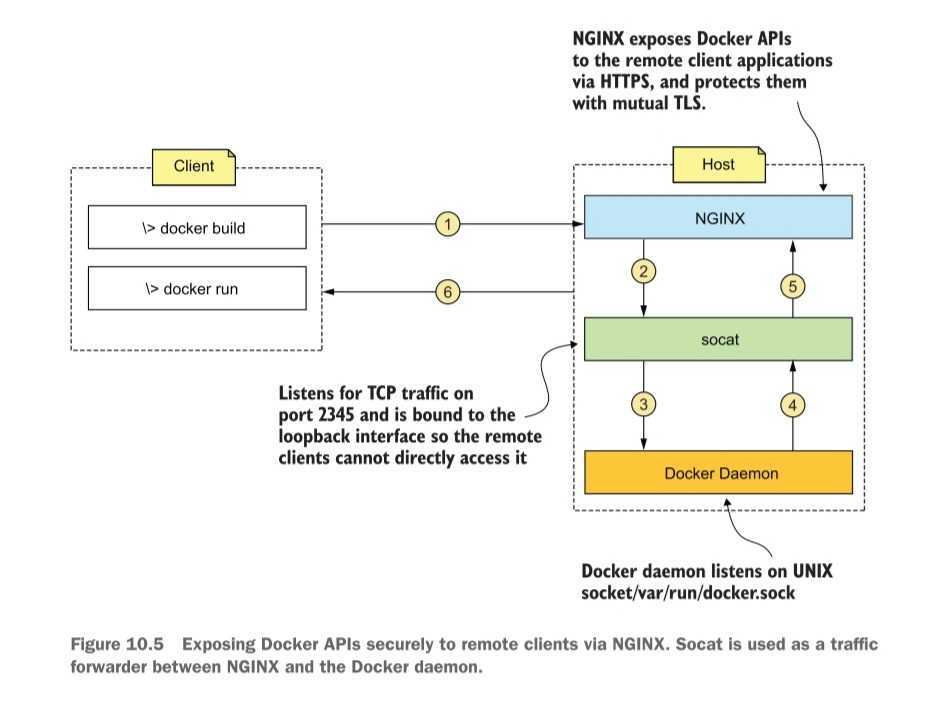

- use mTLS between client and host
  - host: nginx conf
    - `ssl_verify_client` = `on`
    - `ssl_client_certificate` = `path/to/public/key_lit/file`
    - this allows any client with certificate issued by a trusted CA to access the Docker API
  - client
    - `docker --tlsverify`

## Chapter 11. Securing microservices on Kubernetes 

### 11.2,3 configmap, secret

- use configmap to externalize configurations
- use secret for sensitive data
- secret vs configmap
  - secrets are not written to the disk, but only stored in memory
  - Secrets are stored in etcd, thus master node is the only disk it is written on.

### 11.6 user account, service account

- each pod is bound to single service account
- a service account can be bound to many pods.
- benefit of custom service account:
  - isolate what each Pod can do with the Kubernetes API server
  - fine-grained access control on communications among Pods

### 11.7 role-based access control in Kubernetes

- role: set a permissions or capabilities
- Role, ClusterRole
  - Role: permission within a namespace
  - ClusteRrole: permission on Kubernetes cluster level(across the namespace)
- RoleBinding, ClusterRoleBinding
  - RoleBinding: binding between users/services - Role
  - ClusterRoleBinding: binding between users/services - ClusterRole
- Kubernetes has a plugin architecture to authenticate and authorize request. \
  Implementation depends on the plugin.

## Chapter 12. Securing microservices with Istio service mesh 
