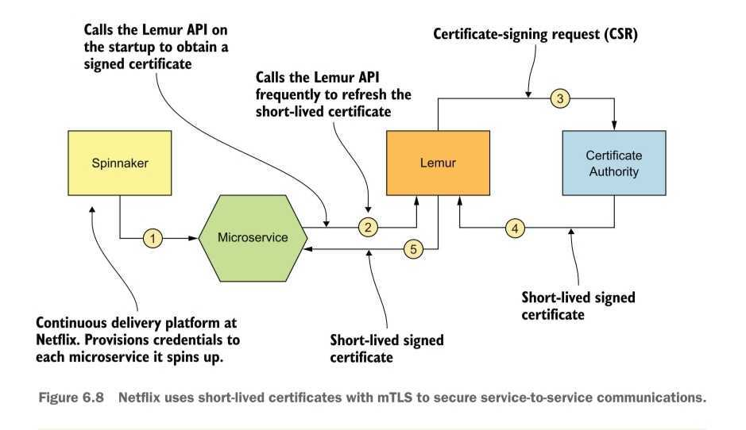

# Microservices Security in Action

- subtitle: Design secure network and API endpoint security for Microservices applications, with examples using Java, Kubernetes, and Istio
- publisher: Manning, 1st Edition(August 4, 2020)
- all the images are from the book!!

---

# Table of Contents

### Part 1. Overview

- [Chapter 1. Microservice Security Landscape](#chapter-1)
  - 1.1 How security works in a monolithic application
  - 1.2 Challenges of securing microservices
  - 1.3 Key Security fundamentals
  - 1.4 Edge Security
  - 1.5 Securing service-to-service communication
- [Chapter 2. First steps in securing microservice](#chapter-2)

### Part 2. Edge Security

- [Chapter 3. Securing north/south traffic with an API gateway](#chapter-3)
  - 3.1 The need for an api gateway in a microservice deployment
  - 3.2 Security at the edge(why OAuth 2.0?)
  - 3.3 Setting up an API gateway with Zuul
  - 3.4 Securing communication between Zuul and the microservice
- [Chapter 4. Accessing a secured microservice via a single-page application](#chapter-4)
  - Architecture of SPA(appendix)
  - Authentication flow of SPA(appendix)
  - With single/multi trust domains(appendix)
- [Chapter 5. Engaging throttling, monitoring, and access control](#chapter-5)
  - 5.1 Throttling at the API gateway with Zuul
  - 5.2 Monitoring and analytics with Prometheus and Grafana
  - 5.3 Enforcing access-control policies at the API gateway with Open Policy Agent

### Part 3. Service-to-service Communication

- [Chapter 6. Securing east/west traffic with certificates](#chapter-6)
  - 6.1 Why use mTLS?
  - 6.5 Challenges in key management
- [Chapter 7. Securing east/west traffic with JWT](#chapter-7)
  - 7.1 Use cases for securing microservices with JWT
- [Chapter 8. Securing east/west traffic over gRPC](#chapter-8)
  - skipped
- [Chapter 9. Securing reactive microservices](#chapter-9)
  - 9.1 Why reactive programming?
  - 9.x securing with kafka, NATS

### Part 4. Secure Deployment

- [Chapter 10. Conquering container security with docker](#chapter-10)
  - 10.2 Managing secrets in a Docker container
  - 10.3 Using Docker Content Trust to sign and verify Docker image
  - 10.5 Running containers with limited privileges
  - 10.6 Running Docker Bench for security
  - 10.7 Securing access to the Docker host
- [Chapter 11. Securing microservices on Kubernetes](#chapter-11)
  - 11.2,3 configmap, secret
  - 11.6 user account, service account
  - 11.7 role-based access control in Kubernetes
- [Chapter 12. Securing microservices with Istio service mesh](#chapter-12)
  - 12.3,4 Securing service-to-service communications with mTLS, JWT
  - 12.5 Enforcing authorization
  - 12.6 Managing keys in Istio

### Part 5. Secure Development

- [Chapter 13. Secure coding practices and automation](#chapter-13)
  - 13.1 OWASP API security top 10
  - 13.2,3 static/dynamic code analysis

### Appendix

- [D. Observability in a microservice deployment](#appendix-D)
  - D.1 The need for obserbability
  - D.2 four pillars of observability
- [F. Open Policy Agent(OPA)](#appendix-F)
  - F.1 Key components in an access-control system
  - F.2 What is an Open Policy Agent?
  - F.3 OPA high-level architecture
  - F.7 External data
  - F.8 OPA integration
  - F.9 OPA alternatives
- [K. Service Mesh and Istio fundamentals](#appendix-K)

  - K.1 Why a service mesh?
  - K.2 The evolution of microservice deployment
  - K.3 Istio service mesh

### etc

- [embedded security vs api gateway vs service mesh](#embedded-security-vs-api-gateway-vs-service-mesh)

---

## Chapter 1. Microservice Security Landscape <a id="chapter-1"></a>

### 1.1 How security works in a monolithic application

- The servlet filter authenticates the request, and adds user information in the web session.
- The inner components assume that the request is valid.
- The security is controlled centrally

### 1.2 Challenges of securing microservices

- More entry point, thus more points to be protected
  - mono: one entry point, in-process call on one jvm
  - micro: many entry points(each one has its own). in-process call -> remote call
- distributed security screening -> poor performance
  - monolithic: security check once
  - mociroservice: repetitive check(w/ remote security token service) \
    -> redundant checks, performance issue
- deployment complexities
  - each microservice needs certifiacte which is used in authentication. Need way to revoke and rotate certificates
- hard to trace the request
  - three pillars of observability: log, metrics, traces
  - request may go through multiple microservices before leaving the system since it enters.
- conatiners are immutable, but allowed clients are dynamically decided(addresses change).
  - store access-control policy in different server(the policy administration end-point)
    - push model: the policy administration endpoint pushes policy updates to the interested microservices
    - pull model: each microservice polls the policy administration end-point
  - certificate should be rotated, injected when the service boots up
- sharing user context is hard since distributed
- polyglot architecture -> each one use different tech stack

### 1.3 Key Security fundamentals

- Authentication: identify the request party
  - clarify the audience first
  - system delegates human user: OAuth 2.0
  - authenticate human user: MFA(Multi Factor Authentication) ex) OTP, FIDO(Fast-Identity-Online)
  - authenticate system: certificates, JWT
- Integrity: check if the data is not modified
  - data in transit: sigin-in. ex) TLS, https
  - data in rest: audit trailing, periodically calculate message digest of audit trail, encyrpt, and store securely
- nonrepudiation: the microservice can not deny that he didn't do the transaction
  - digital signature, record of signature and timestamp
- confidentiality
  - protect from uninteded disclosure
  - when hijacked, data should not be understandable
  - encryption.(however, it is expensive)
  - data in transmit \
    ex) TLS with proxy server,
    - TLS bridging: proxy server terminates TLS connection and creates a new one. Data is readable in the proxy server.
    - TLS tunneling: proxy server creates a tunnel. Data is unreadable in the proxy server.
  - data in rest: database
- availiability: the system should be running, no matter what
  - Security takes a key role in making system constantly available to stakeholders
  - firewall, api gateway
- authorization: do you have a permission?

### 1.4 Edge Security

- role of API Gateway
  - expose a selected set of microservices to the outside world-as API
  - build quality-of-service(QoS) features(security, thorttling, analytics)
- authentication
  - certificate-based: server to server. mTLS
  - OAuth 2.0: human(delegate to server) to system
- authorization
- passing client/user context to upstream microservices: http header, jwt

### 1.5 Securing service-to-service communication

- service-to-service communication
  - synchronous: http
  - asynchronous: message queue
- service-to-service authentication
  - trust the network
    - old-school model
    - no security
    - opposite of zero-trust network(every request is checked)
  - mTLS
    - transport layer
    - each microservice carries public/private key
  - JWT
    - application layer
    - JWT includes claims and is signed by the issuer. \
      issuer can be STS or the micrsoervice itself
    - works over TLS
- service-level authorization
  > PDP(Policty Decision Point)
  - centralized PDP model
    - access-control policies are defined, stored, and evaluated centrally
    - to authenticate, need to talk to the endpoint
    - create dependency on the PDP and increase latency. \
      caching can decrease latency
  - embedded PDP model
    - policies defined centrally but stored and evaluted at the service level
    - the challenge: how to update policy from the centralized policy administration point(PAP)
      - poll or push
      - since servers load policies when boot, the service should restart to reload. -> overkill
- propagating user context among microservices
  - http header: can be modified
  - JWT issued by calling service: calling service can lie about the user context
  - JWT issued by external STS: most secure
- crossing trust boundaries

  - w/o api gateway between trust domain

    1. api gateway -> order processing service with jwt signed by the gateway, jwt's `aud`: order processing service`
    2. order processing microservice -> STS of foo domain.
    3. foo STS returns new JWT signed by it, jwt's `aud`: STS of bar
    4. order processing microservice -> STS of bar
    5. get new JWT signed by STS of bar, jwt's `aud`: delivery microservice
    6. order processing microservice access declivery microservice

    

  - w/ api gateway between trust domain

    1. api gateway -> order processing service with jwt signed by the gateway, jwt's `aud`: order processing service
    2. order processing microservice -> STS of foo domain.
    3. foo STS returns new JWT signed by it. jwt's `aud`: api gateway of the bar
    4. order processing microservice -> api gateway of bar
    5. api gateway of bar -> STS of bar \
       bar STS creates jwt with `aud`: delivery microservice
    6. api gateway of bar -> delivery microservice

    

## Chapter 2. First steps in securing microservice <a id="chapter-2"></a>

- OAuth 2.0

.

## Chapter 3. Securing north/south traffic with an API gateway <a id="chapter-3"></a>

> - north/south traffic
>   - edge security \
>     (protecting a set of resouces at the entrypoint to the deployment, at the API gateway)
>   - api gateway pattern
> - east/west traffic
>   - service-to-service security
>   - service mesh pattern

### 3.1 The need for an api gateway in a microservice deployment

- Decoupling security from the microservice
  - Change of security protocol requires changes in the microservice
  - Scaling up the microservice results in more connections to the authorization server
- Consistent interface while microservices may be inconsistent. \
  (microservices tend to have diverse tech stack, complex structures)
- hide inner structure
  - in some cases, read happens much more than writes
  - with api gateway, we can divide read-service and write-service but maintain the identical entrypoint.

### 3.2 Security at the edge(why OAuth 2.0?)

- diverse consumers: internal, external, hybrid applications
- delegating access: client application access on behalf user
- why not basic authentication?
  - username and password are static, long-living(no expiration)
  - no scope check
- why not mTLS?
  - has expiration, which solves basic authentication's problem but...
  - no access delegation
- Why OAuth 2.0?
  - who: only permitted entities
  - what purpose: scope
  - how long: ensure that access is granted for the desired period

### 3.3 Setting up an API gateway with Zuul

- Firewall blocks the direct access from client application to microservice/authorization server
- JWT
  - Authorization server is hard to scale but recieves many requests.
  - If access token contains information needed for authentication, we can solve this problem.
  - pitfalls of self-validating-token
    - no way to revoke prematurely
      - solution1: short-lived JWT
      - solution2: inform the API gateway of the revoked tokens
    - certificate used to verify a token signature might have expired. \
      then, JWT can no longer be verified.
      - solution1. deploy the new certificate when renewed
      - solution2. provision the ceritifacte of the CA(certificate authority) of the token issuer.

### 3.4 Securing communication between Zuul and the microservice

- preveneting access with the firewall
- use mTLS in communcation between the api gateway and microservices

## Chapter 4. Accessing a secured microservice via a single-page <a id="chapter-4"></a>application

### Architecture of SPA(appendix)


### Authentication flow of SPA(appendix)

- authentication flow

  

- with webserver

  

- with resource server

  

### With single/multi trust domains(appendix)

- The client application(SPA), authorization server, and resource server need to be in the same trust domain.

  

- To build trusts between multiple trust domains,
  - web server should exchange token from authorizations server to the one for domain 2.
  - in case of JWT, JWT bearer grant type accepts a JWT, validates it, and issues a valid OAuth-2.0 token(which is another JWT or opaque token string)
    

## Chapter 5. Engaging throttling, monitoring, and access control <a id="chapter-5"></a>

> Throttling \
> a. the suppression or prevention of an activity \
> b. the activity or process of limiting the bandwidth available-to users of an electronic communication systems (such as the Internet) \
> reference: merriam-webster dictionary

### 5.1 Throttling at the API gateway with Zuul

- scaling is not free. \
  Also, there is a physical limit on how much we can scale the system. \
  Thus limiting the number of requests(throttling) is needed.
- basic notion: count the number of requests and if exceeds the limit, block
  - Quota-based
    - provide each application a quota
    - identify application with client-id which can be retrieved from auth server with access token
  - fair usage policy for user
    - in case of multiple users per application, ex) 20 users on one application
    - ex) JWT, use sub claim to identify user
- set maximum threshold limit
- operation level throttling
  - Single api may have two microservices. One for read, the other for write.
  - Throttling may be required on operation-level
- Throttling the OAuth 2.0 token and authorization endpoints
  - Throttling on auth server api is hard, since the requests are before authenticated, which means we can not identify the source of the request
  - Only ip is available, and it is out of the handling scope of the api gateway. Instead, deal with firewall
- privilege-based throttling
  - higher privilege may have more quota

### 5.2 Monitoring and analytics with Prometheus and Grafana

- prometheus pulls metrics data from microservice periodically
- Also, it has a push-gateway for short-lived process, to send-data before prometheus polls


### 5.3 Enforcing access-control policies at the API gateway with Open Policy Agent


## Chapter 6. Securing east/west traffic with certificates <a id="chapter-6"></a>

### 6.1 Why use mTLS?

- TLS
  - with tls, no one in the middle can see what it is
  - client application can identify the server that it communicates with
  - the server should have valid certificate that is trusted by all the client applications
- CA(certificate authority)
  - A third party that signs the certificate given to the service
  - Few trusted CA exist. Their public keys are embedded in all browsers
  - browser can verify that the service's certificate is valid by verifying the signature against the CA's public key.
- mTLS
  - both server and client must have valid certificate and trust corresponding certificates.
  - secure communications between microservices

### 6.5 Challenges in key management

- bootstraping trust
  - have a single CA, and each microservice trust this CA
- provisioning key/certificates to workloads or microservices

  - typical key provisioning process at an enterprise
    - generate public/private key pair
    - create a certificate signing request(CSR) & submit
    - when accepted, deploy the certificate and the keys to the microservice
  - at netflix: use Lemur

    - open source certificate mangement framework
    - acts as a broker between internal service deployment and the CA
    - provide mangement tool to automate the key proisioning process
    - issued keys are short-lived

    

  - generating long-lived credentials

    - at netflix, each server use long-lived credential to talk to Lemur API to renew current signed certificate(short-lived).
    - recommended solution
      ```
      1. Protect the API of the certificate issuer (such as Lemur) so that anyone who wants to access it must present a valid key.
      2. Build a handler to intercept the continuous delivery (CD) pipeline that injects long-lived credentials into the microservices.
      3. Write the intercept handler in such a way that it generates long-lived credentials as JWTs. The JWT will carry information about the microservice and will be signed by a key that’s known to the certificate issuer. We discuss JWTs in detail in chapter 7.
      4. At boot-up time, the microservice uses the injected long-lived credentials (JWT) to talk to the certificate issuer’s API and to get a signed certificate. It can keep using the same long-lived credentials to rotate certificates.
      ```

  - SPIFFE
    - SPIFFE(Secure Production Identity-Framework For Everyone): open standard that defines a way a microservice can establish an identity- - SPIFFE Runtime Environment: open source reference implementation of SPIFFE

- key revocation

  - cases
    - private key is compromised
    - CA's private key is compromised
    - the detail of CSR is invalid
      - certificate does not represent the original entity at the time the certificate was issued.
  - CRL(certificate revocation list): old way, up to TLS client's application
  - OCSP(Online Certificate Status Protocol)
    - tls client asks to the OCSP end point if the certificate is revoked, every time it sees.
    - increase client-side latency
    - unclear if the response contain updated revocation information. cached response
    - response can be faked, filtered, etc.
    - privacy risk. OCSP responder knows end user
  - OCSP stapling
    - server recieves the staple from the OCSP end point and attaches it when it responds to the client
  - short-lived certificate
    - only rely on expiration
    - short-lived certificate is in-memory thus cheap, \
      whereas loading long-lived certificate is expensive
    - netflix uses a layered approach \
      during bootup, use long-lived credentials, then each microservice get short-lived credentials using the long-lived credentials

- key rotation

  - key rotation interval depends on the expiration time.
  - keys embedded in the microservices can be short-lived and rotated frequently, but CA's private key doesn't need to be.
  - upating CA's private key has high overhead. All the microservices should have the updated key. \
    Neflix uses TPM and SGX.
  - automation is required. \
    SPIFFE is one of the solutions.

- monitoring key usage
  - logging, metrics, tracing

## Chapter 7. Securing east/west traffic with JWT <a id="chapter-7"></a>

### 7.1 Use cases for securing microservices with JWT

- two goals:

  - secure service-to-service communications
  - pass end-user context across microservices

- shared JWT

  - when identity of the end user is needed in access control, and the microservice isn't relevant
  - need to carry user context on every request
  - still, JWT with mTLS is better option.(double defense)
  - how
    - STS authenticates the request once, returns new JWT
    - this JWT is used acroos all requests
    - the microservice validates JWT by itself.

  

- new JWT for each service-to-service interaction

  - how: generate new JWT for each service interaction
    - when the microservice recieves request, it authenticates JWT by itself.
    - before sending request to other microservice, create new JWT with STS.(4.a, 4.b)
    - field to check for token exchange request: `subject_token_type`, `grant_type` \
      ex) [google OAuth 2.0 token exchange parameter](https://cloud.google.com/iam/docs/reference/sts/rest/v1beta/TopLevel/token)
  - why this approach?

    - We can put the target microservice in the JWT's audience field. It explicits who the intended audience is.
    - STS is a better place to control access than microservice itself. \
       STS always knows who initiated the token exchange and the callee of the request.

  

- new JWT for microservices between different trust domain

  - how
    - api gateway in target trust domain authenticates the token with that domain's STS(step 8) \
      target domain's STS should trust source domain's STS
    - target trust domain's STS returns new STS(step 9)

  

- self-issued JWT

  - how
    - previously, JWT was issued by trusted STS. Thus to authenticate the token, STS's public key was required.
    - self-issued JWT is generated by each microservice with its own private/public key.
    - self-issued JWT is passed as an http header over tls. \
      The reciever validates with the public key of the sender.
  - mTLS vs. self-issued JWT
    - self-issued JWT ~ mTLS(on a par) : only for authenticating between services.
    - self-issued JWT > mTLS: when sharing contextual data.
    - mTLS
      - provides: confidentiality and integrety of the data in transit
      - not provides: nonrepudiation
    - self-issued JWT is signed with issuer's private key \
       -> provides repudiation
      > bearer token: anyone who steals a bearer token can use it without any problem until the token expires.

- nested JWT

  - JWT that embeds another JWT. extension of self-issued JWT
  - inner JWT is signed with STS's private key. \
    outer JWT is signed by the sender's private key.
  - it holds the identity of the end user and the calling microservice

  

## Chapter 8. Securing east/west traffic over gRPC <a id="chapter-8"></a>

skipped

## Chapter 9. Securing reactive microservices <a id="chapter-9"></a>

### 9.1 Why reactive programming?

- loose coupling between the source microservice and the target microservice.

### 9.x securing with kafka, NATS

- often use message broker: kafka, NATS
- security check
  - only trusted service can talk to kafka: mtls \
    with tls, any client can talk to kafka
  - control access to topics: ACL \
    kafka provides acl-control

## Chapter 10. Conquering container security with docker <a id="chapter-10"></a>

- The security of a microservice deployment should be thought of in the context of a container orchestration framework, not just as container security in isolation

### 10.2 Managing secrets in a Docker container

- externalizing secret from Docker image(`--mount`)
- passing secret as environment variables(`--env`)
- above two are not recommended for production, utilize container orchestration framework

### 10.3 Using Docker Content Trust to sign and verify Docker image

- DCT(Docker Content Trust) signs and verifies docker image. \
  It depends on Notary(open source project for signing and verifying content, image, anything)
- To publish an image to the Docker registry, sign it with private key
- When pulling image from the Docker registry, verify the image with public key.
- types of keys used in DCT: skipped
- how DCT protects the client application from replay attacks: skipped

### 10.5 Running containers with limited privileges

- two types of processes
  - privileged process
    - userId: 0
    - bypass all kernel-level permission
    - default user of Docker container
  - unprivileged process
    - userId: any number except 0
    - go through permission check
  - Any change made inside the container as a root user does not affect the host machine, except when using volume.
- Running a container with a nonroot user
  - `--user` option on `docker run`
  - `--cap-drop`, `--cap-add` on `docker run` \
    (Linux kernel's `capabilities` feature)

### 10.6 Running Docker Bench for security

- a script that checks a Docker deployment best-practices defined by Center for Internet Security.
- open source project

### 10.7 Securing access to the Docker host


- use mTLS between client and host
  - host: nginx conf
    - `ssl_verify_client` = `on`
    - `ssl_client_certificate` = `path/to/public/key_lit/file`
    - this allows any client with certificate issued by a trusted CA to access the Docker API
  - client
    - `docker --tlsverify`

## Chapter 11. Securing microservices on Kubernetes <a id="chapter-111"></a>

### 11.2,3 configmap, secret

- use configmap to externalize configurations
- use secret for sensitive data
- secret vs configmap
  - Secrets are not written to the disk, but only stored in memory.
  - Secrets are stored in etcd, thus master node is the only disk the secret is written on.

### 11.6 user account, service account

- each pod is bound to single service account
- a service account can be bound to many pods.
- benefit of custom service account
  - isolate what each Pod can do with the Kubernetes API server
  - fine-grained access control on communications among Pods

### 11.7 role-based access control in Kubernetes

- role: set a permissions or capabilities
- Role, ClusterRole
  - Role: permission within a namespace
  - ClusteRrole: permission on Kubernetes cluster level(across the namespace)
- RoleBinding, ClusterRoleBinding
  - RoleBinding: binding between users/services and Role
  - ClusterRoleBinding: binding between users/services and ClusterRole
- Kubernetes has a plugin architecture to authenticate and authorize request. \
  Implementation depends on the plugin.

## Chapter 12. Securing microservices with Istio service mesh <a id="chapter-12"></a>

- Istio SDS(Secret Discovery Service): key provisioning and rotation

### 12.3,4 Securing service-to-service communications with mTLS, JWT

- VirtualService: microservice that we want the client application to access through the Istio Ingress gateway
- Istio version < 1.5.0
  - MeshPoliscy: CRD for authentication in service mesh level
- Istio version >= 1.5.0
  - mTLS enabled for all microservices by default.
  - PeerAuthentication: CRD to define policies for mTLS.
  - RequestAuthentication: CRD to define policies for JWT authentication \(!caveat: request with invalid JWT - reject, request without JWT - not reject)
- Istio does not support propagating JWT that one microservice gets to another upstream microservice. Should implement by yourself.
- JWK, JWKS
  - JSON Web Key(JWK): JSON representation of a cryptographic keys
  - JSON Web Key Set(JWKS): representation of multiple of JWKs.
  - Envoy proxy uses JWKS endpoint to fetch a set of JWK. \
    The kid of JWK should match with the kid of JWT header

### 12.5 Enforcing authorization

- Istio version < 1.4.0
  - ServiceRole, ServiceRoleBinding, ClusterRole, ClusterRoleBinding : deprecated. removed from 1.6.0
- Istio version >= 1.4.0
  - AuthorizationPolicy
    - request authentication \
      () are fields of AuthorizationPolicy CRD.
      ```
      allow (action) to (to) do an HTTP get/post(operation/method) on microservice(match label) when (when) the value matches the condition.
      ```
    - peer authentication \
      add (source) field

### 12.6 Managing keys in Istio

- Citadel provisions keys/certificates to each workload
- Istio version < 1.1.0
  - keys/certificte was provisioned to Envoy proxy by volume mount(`/etc/certs`)
  - Citadel keeps track of the expiration and provisions before expiration.
  - limits
    - Envoy proxies have to restart to load the new key/ceritficate
    - The private keys are generated by Citadel which is located outside the Kubernetes node. \
      -> Transferring keys from Citadel to the Kubernertes node is one potential security issue.
- Istio version >= 1.1.0

  - SDS(secret Discovery Service) node agent talks with Citadel for certificate request/response.
  - node agent keeps track of the expiration(with timer job)
  - when the key is close to expiring, the node agent sends a message to the corresponding Envoy proxy, and the proxy gets the new key(rerun the process in the diagram)
  - Istio version < 1.5.0: node agent inside every kubernetes node
  - Istio version >= 1.5.0: moved to Envoy proxy

  

## Chapter 13. Secure coding practices and automation<a id="chapter-13"></a>

### 13.1 OWASP API security top 10

- open source project aimed at preventing organizations from deploying potentially vulnerable APIs.
- top 10 list of API security vulnerabilities

#### 1. broken object-level authorization

- vulnerability for using identifiers(IDs) to retrieve information from APIs. \
  ex) curl -i -X GET "https://graph.facebook.com/{user_id}
- avoid passing user-id
- use a random or unguessable ID
- if you use autoincrementing integer of DB, it gives hint on the range of IDs. \
  ex) request with 5, request with 1000 -> id : at least 5 ~ 1000 are valid

#### 2. broken authentication

- when authentication is not implemented properly
- OAuth 2.0 is a protocol. \
  If used with wrong `grant_type` or wrong expiration time, API can be vulnerable
- Refer to OAuth 2.0 Security Best Current Practice, OAuth 2.0 Threat Model and Security Considerations document, JSON Web Token Best Current Practices

#### 3. excessive data exposure

- API should return only the data that are relevant and required for its consumer.
- easily found in error handling. ex) stacktrace on API response

#### 4. lack of resources and rate limiting

- preventing DDos
- limit the maximum number of records
- limit the maximum call per time period

#### 5. broken function-level authorization

- authorization should be done on operation level, not api level
  - operation level: ex) is `GET /users/{use_id}` allowed?
  - api level: ex) is `/users/{user_id}` allowed?

#### 6. mass assignment

- API should select the field that are needed from the request
- Do not dump entire request input into the entity
- Ideally, define different JSON objects for the corresponding operation

#### 7. security misconfiguration

- ex) not disabling HTTP when only allowing HTTPS.
- API contact security auditor can help finding misconfigurations
- Netflix Security Monkey is a tool that tests AWS and GCP accounts whether they are run on secure configurations.

#### 8. injection

- when API accepts data and execute it as a part of a query or a command on the interpreter.
- user input should always be sanitized.

#### 9. improper asset management

- with many APIs, easy to miss patching security updates on some APIs, especially old ones.
- document and maintain well.

#### 10. insufficient logging and monitoring

- the lack of logs and monitoring results in not knowing what's going on in a system
- A system that analyzes user behavior and processes behavior data to find abnormalities and suspicious patterns is the only way of detecting and preventing vulnerabilities.

### 13.2,3 static/dynamic code analysis

- static code analysis
  - code debugging without executing code(without running program)
  - ex) SonarQube(you can integrate with Jenkins)
- dynamic analysis
  - code check with executing code
  - ex) OWASP ZAP(proxy between client and server, analyzes request and response for potential vulnerabilities)
  - penetration test: process of testing a computer system, network, or web application for vulnerabilities
    - passive scanning
      - only check responses with known vulnerabilities.
      - Does not modify website's data
      - when you don't have permission
      - not so effective
    - active scanning
      - use known techniques to find vulnerabilities
      - ex) sql injection
      - should be only performed in dedicated environment(ex. QA)
- challenge
  - tools produce lots of false positives.
  - To minimize it, build a vulnerability mangement system that learns from earlier experience.

---

# Appendix

## D. Observability in a microservice deployment<a id="appendix-D"></a>

- observability = monitoring + analyzing

### D.1 The need for obserbability

- in monolithic application, if a process fails, whole applications fails -> no paritial failure
- in microservice architecture, easy to have partial failure. \
  process may run in different microservice.
  - target microservice may respond slow -> timeout
  - microservice currently available
  - may have a few slow db queries
  - data inconsistency on db

### D.2 four pillars of observability

- metrics
  - a set of data values that are recorded over a time \
    typically min, max, average, percentile.
    ex) CPU usage, load average, ...
  - easy to monitor
  - but, only useful to monitor a given microservice in isolation, based on a limited set of attributes.
  - if too many metrics, hard to store and manage
- trace

  - a sequence of related distributed events
  - A single trace will have a unique ID(UID), which spans across all the parties involved in the trae.
  - like a collection of logs
  - carries information needed for debugging, like entrypoint timestamp, latency information, ...

  
  

  <details>
  <summary> scenario </summary>

  
  </details>

  - global standard, library for tracing: OpenTracing, OpenCensus, OpenTelemetry
  - major challenge
    - hard to fit into exising system.
    - need to add instrumentation code to a lot of places.
    - use sidecar pattern
      

- log
  - Fluentd
- visualization
  - Kibana, Grafana

## F. Open Policy Agent(OPA)<a id="appendix-F"></a>

- two locations for authentication in microservice deployment
  - the edge of the deployment: typically with api gateway
  - the edge of the service: typically with a service mesh or embedded library
- coarse-grained control at the edge(api gateway), \
  fine-grained control in the service level. \
  ex) authentication on `HTTP GET /users/{user-id}`: edge level \
  order admin can view orders >= \$1000 : service level check
- OPA: open source, lightweight, general-purpose policy engine with no dependency on microservice

### F.1 Key components in an access-control system


- PAP(Policy Administration Point)
  - the component that lets policy administrator define access-control policies
  - it sotres the policy into the poicy store \
    policy store: db, file system, service, etc
- PEP(Policy Enforcement Point)
  - locates between client and server
  - intercepts requests -> ask PDP for authentication check
  - PEP can be api gateway, embedded interceptor, proxy of service mesh
- PDP(Policy Decision Point)
  - check if the request is authorized
    - PDP loads policies from the policy store.
    - if need more information, (ex. request have only `user-id` but need `user's age` for permission check) \
      ask PIP(Policy Information Point) for info.
  - if authorized, send the request to the service or API
  - if not authorized, return error to the client
  - before the request hits the PEP, we assume it's properly authenticated.(?)

### F.2 What is an Open Policy Agent?

- OPA: open source, lightweight, general-purpose policy engine with no dependency on microservice. \
  incuating project under CNPF(Cloud Native Computing Foundation)
- netflix, cloudflare, pinterest, ... use opa
- uses a declarative langauge called Rego to define access-control policies

### F.3 OPA high-level architecture


- OPA acts as PDP. It only makes "decision".
- It exposes a set of REST APIs that PEP can connect to andd check authorization.
- you need to build these by yourselves.
  - PAP: policy authorizing tool
  - policy store: a mechanism to publish policies to the OPA server

### F.7 External data

- how to provide extra data to OPA server that is not in the request, but needed for authentication
- ex) to check if the user can drink alcohol, we need age info. \
  but request holds only `user-id`, \
  then, we need the data that maps `user-id` to `user-age`

#### F.7.1 push data

- by data API provided by OPA server
- however, data is only stored in memory. \
  Data is lost when reboot. \
  Need to push again.
- kubernetes admission control use this method. \
  It has a sidecar running next to OPA that synchronizes the state of OPA with external data.

#### F.7.2 file system

- drawback
  - to update, need to restart the OPA server
  - there is dynamic reload option, but not recommended for production
- if in kubernetes environment,
  keep the policies and the data in git repo and use init continaer to fetch. \
  if need update, restart toe pod

#### F.7.3 overload

- pass the all data needed for authentication on request.
- when PEP sends the authorization request to OPA server, \
  it can add extra data needed for authentication.
- trust between OPA client and server is needed

#### F.7.4 JWT

- use JWT to pass extra data to OPA server

#### F.7.5 Bundle API

- bundle: gzipped tarball which carries OPA policies and data files.
- bundle server: endpoint that hosts a bundle. ex) AWS S3 bucket, github repo
- OPA server polls the bundle server, and get the latest bundle

#### F.7.6 pull data

- experimental feature
- don't store the data, but pull from outside when needed

### F.8 OPA integration

- Istio
  - Mixer: Istio component that takes care of precondition checking, quota mangement, telemetry reporting
  - two pattern
    - OPA Mixer Adapter(plugin)
      - when request hits Envoy proxy, \
        Envovy proxy -> Mixer -> Mixer Adapter(authentication) -> Mixer -> Envoy proxy
    - sidecar of Envoy
      - when request hits Envoy proxy, \
        Envovy proxy -> sidecar(authentication) -> Envoy Proxy
      - decisions made locally. better availibilty, performance
- Kubernetes admission controller: OPA Gatekeeper
- kafka: OPA Auuthorizer plugin with kafka

### F.9 OPA alternatives

- XACML

## K. Service Mesh and Istio fundamentals<a id="appendix-K"></a>

- service mesh deals with east/west traffic(traffic among microservices)
- decouples traffic security with microservice(business logic)

### K.1 Why a service mesh?

- embedded service mesh

  - ex) calling spring security library in the application
  - drawback) - if spring security libary changes api, need update - in microservice architecture, each microservice might use differne language/framework. \
     -> not all microservice can use spring security.

  

- out-of-process service mesh

  - runs apart from the microservice, intercepts the traffic coming into and going out of the microservice

  

### K.2 The evolution of microservice deployment


- data plane
  - service proxy
    - proxy that intercepts all the request coming in and going out of the microservice
    - enforce security, do monitoring, mange traffic, peform service discovery, circuit breaker etc.
    - act as PEP(Policy Enforcement Point)
    - in typical service mesh architecture, each microservice has its own service proxy. \
      All in-and-out traffic from a microservice flows through the service proxy
  - ingress gateway
    - handle traffic entering into the microservice deployment
  - engress gateway
    - handle traffic leaving the microservice deployment
- control plane
  - PAP(Policy Administration point)
  - define all the control instructions to operate service proxies
  - never touch data packet on runtime
- implementations: Istio, Linkerd, HashCorp, Aspen Mesh, AWS App Mesh, Microsoft Azure Service Fabric, Redhat OpenShift Service Mesh, ...

### K.3 Istio service mesh


- data plane
  - service proxy: Envoy
    - Envoy is deployed in each Pod as a sidecar
    - Kubernetes puts all the containers in the given pod in the same node.
    - traffic comes to the container go through Envoy, \
      traffic leaves the container go through Envoy.
    - provides
      - http/2 and gRPC support
      - protocol translation
      - load balancing
      - observability
        - generates stats: downstream(incoming connection), upstream(outgoing connection), server(health of Envoy proxy)
        - generate unique id for tracing
      - security
        - act as PEP
        - Envoy and microservice are on the same pod -> never leave the node.
        - supports mTLS, JWT, RBAC, ...
  - Ingress gateway
    - route traffic fro outside the cluster to a Kubernetes service
  - Engress gateway
    - handle outgoing traffic from the deployment
- control plane

  - Pilot
    - help to define routing rules and configurations for service-service communication \
      ex) 20% of traffic to v1 and 80% of traffic to v2, connection timeout, circuit breaker
    - Envoy pulls policies from Pilot
    - Pilot exposes an API for Istio Administrator to define policies and configurations
  - Galley
    - bridge between Pilot and Kubernetes \
      (The Galley knows how to talk to Kubernetes)
  - Mixer
    - precondition checking(policy), quota management, telemetry reporting(logging, tracing, metrics)
  - Citadel
    - maintains an identity for each workload.
    - provision X.509 certificates to each workload and manage.

- without ingress

  

- with ingress

  

---

# etc

### embedded security vs api gateway vs service mesh

- embedded security

  - ex) calling spring security library in the application
  - drawback) - if spring security libary changes api, need update - in microservice architecture, each microservice might use differne language/framework. \
    -> not all microservice can use spring security.

  

- gateway

  - control deployment access
    
    

- service mesh
  - control deployment access & microservice access
    
